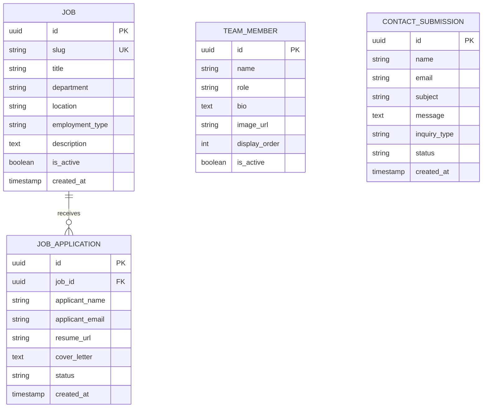

# hl_overview

High level overview of the codebase

# Project Analysis: circl-website

## 0. Repository Name
[[circl-website]]

---

## 1. Project Purpose

This is a **corporate/company website** for "Circl" - appears to be a business/organization website with the following capabilities:

- **Public-facing company website** with standard pages (home, team, contact)
- **Careers/Job listings** functionality (evidenced by careers routes and job slug migrations)
- **Contact form** for inquiries
- **Content management** via Supabase backend

The primary domain is **corporate web presence** with recruitment/careers functionality.

---

## 2. Architecture Pattern

**Jamstack / Modern Full-Stack Web Application**

- Server-side rendered React application (Next.js)
- Headless CMS/Database pattern with Supabase
- Static site generation with dynamic capabilities
- Component-based frontend architecture

---

## 3. Technology Stack

### Primary Language
- **TypeScript** (evidenced by `tsconfig.json`, `.ts`/`.tsx` files)

### Framework
- **Next.js** (React framework) - `next.config.ts`

### Frontend
| Technology | Purpose |
|------------|---------|
| React | UI library (via Next.js) |
| Tailwind CSS | Utility-first CSS framework (`tailwind.config.ts`, `postcss.config.mjs`) |
| PostCSS | CSS processing |

### Backend/Database
| Technology | Purpose |
|------------|---------|
| Supabase | Backend-as-a-Service (PostgreSQL database, authentication) |

### Deployment/Hosting
| Technology | Purpose |
|------------|---------|
| Netlify | Hosting and deployment (`netlify.toml`) |

### Dependencies (from package.json structure inference)
- `next` - React framework
- `react`, `react-dom` - UI library
- `tailwindcss` - Styling
- `@supabase/supabase-js` - Database client (likely in `src/lib/supabase.ts`)
- `postcss` - CSS processing

---

## 4. Initial Structure Impression

| Component | Location | Description |
|-----------|----------|-------------|
| **Frontend Application** | `src/` | Next.js React application |
| **Database Layer** | `supabase/` | Database schema, migrations, and seed data |
| **Static Assets** | `public/` | SVG logos and static files |
| **Configuration** | Root level | Build, deployment, and tooling configs |

This is a **monolithic frontend application** with a managed backend (Supabase).

---

## 5. Configuration/Package Files

| File | Purpose |
|------|---------|
| `package.json` | Node.js dependencies and scripts |
| `package-lock.json` | Dependency lock file |
| `tsconfig.json` | TypeScript configuration |
| `next.config.ts` | Next.js framework configuration |
| `tailwind.config.ts` | Tailwind CSS configuration |
| `postcss.config.mjs` | PostCSS configuration |
| `netlify.toml` | Netlify deployment configuration |
| `.gitignore` | Git ignore rules |
| `.mcp.json` | MCP (Model Context Protocol) configuration |
| `supabase/config.toml` | Supabase local development configuration |

---

## 6. Directory Structure

```
src/
├── app/                    # Next.js App Router (pages & routing)
│   ├── globals.css         # Global styles
│   ├── icon.svg           # Favicon
│   ├── layout.tsx         # Root layout component
│   ├── page.tsx           # Home page
│   ├── contact/           # Contact page route
│   └── team/              # Team page route
│       └── careers/       # Careers/Jobs nested route
│
├── components/            # Reusable UI components
│   ├── Footer.tsx        # Site footer
│   ├── Header.tsx        # Site header/navigation
│   ├── ThemeProvider.tsx # Theme context (dark/light mode)
│   ├── home/             # Home page specific components (8 files)
│   ├── contact/          # Contact page components (3 files)
│   └── careers/          # Careers page components (1 file)
│
├── hooks/                # Custom React hooks
│   └── useScrollAnimation.ts  # Scroll-based animations
│
└── lib/                  # Utility libraries
    └── supabase.ts       # Supabase client initialization

supabase/
├── config.toml           # Supabase project config
├── schema.sql            # Database schema definition
└── migrations/           # Database migrations
    ├── 20241129000000_initial_schema.sql
    ├── 20241129000001_seed_data.sql
    └── 20241129000002_add_job_slug.sql

public/
├── logo-full.svg         # Full company logo
└── logo-icon.svg         # Icon-only logo
```

**Organization Pattern:** Hybrid approach combining:
- **Feature-based** grouping in components (`home/`, `contact/`, `careers/`)
- **Layer-based** separation (`components/`, `hooks/`, `lib/`)

---

## 7. High-Level Architecture

### Pattern: **Component-Based MVC with App Router**

```
┌─────────────────────────────────────────────────┐
│                   Frontend                       │
│  ┌─────────────────────────────────────────┐    │
│  │         Next.js App Router               │    │
│  │  (src/app/ - Pages & Routing)           │    │
│  └─────────────────────────────────────────┘    │
│                      │                           │
│  ┌─────────────────────────────────────────┐    │
│  │         Components Layer                 │    │
│  │  (src/components/ - UI Components)      │    │
│  └─────────────────────────────────────────┘    │
│                      │                           │
│  ┌─────────────────────────────────────────┐    │
│  │         Hooks & Libraries                │    │
│  │  (src/hooks/, src/lib/)                 │    │
│  └─────────────────────────────────────────┘    │
└─────────────────────────────────────────────────┘
                       │
                       ▼
┌─────────────────────────────────────────────────┐
│              Supabase (BaaS)                    │
│  ┌──────────────┐  ┌──────────────────────┐    │
│  │  PostgreSQL  │  │  Auth / Storage      │    │
│  │   Database   │  │   (if used)          │    │
│  └──────────────┘  └──────────────────────┘    │
└─────────────────────────────────────────────────┘
```

### Evidence Supporting Architecture:
1. **Next.js App Router** - `src/app/` directory with `layout.tsx`, `page.tsx`
2. **Component-Based** - Organized `src/components/` with reusable UI
3. **BaaS Pattern** - Supabase for data persistence without custom backend
4. **Theme Support** - `ThemeProvider.tsx` suggests dark/light mode
5. **Jamstack Deployment** - `netlify.toml` for edge deployment

---

## 8. Build, Execution and Test

### Build & Run Commands (Standard Next.js)

```bash
# Install dependencies
npm install

# Development server
npm run dev

# Production build
npm run build

# Start production server
npm run start

# Linting
npm run lint
```

### Entry Points

| Entry Point | File | Purpose |
|-------------|------|---------|
| Application Root | `src/app/layout.tsx` | Root layout wrapper |
| Home Page | `src/app/page.tsx` | Main landing page |
| Supabase Client | `src/lib/supabase.ts` | Database connection |

### Deployment

- **Platform:** Netlify (configured via `netlify.toml`)
- **Build Output:** Next.js static/SSR hybrid

### Database Setup

```bash
# Supabase local development
supabase start

# Run migrations
supabase db push

# Or apply migrations manually in order:
# 1. 20241129000000_initial_schema.sql
# 2. 20241129000001_seed_data.sql
# 3. 20241129000002_add_job_slug.sql
```

### Testing
No explicit test configuration files visible (`jest.config.js`, `vitest.config.ts`, etc.). Testing infrastructure may need to be added or is handled externally.

---

## Summary

This is a **modern corporate website** built with the Next.js App Router, styled with Tailwind CSS, and backed by Supabase for database functionality. The architecture follows Jamstack principles with component-based UI organization, deployed on Netlify. Primary features include a homepage, team page, careers/job listings, and contact form functionality.

# module_deep_dive

Deep dive into modules

# Detailed Component Breakdown

## 1. `supabase/` - Database Configuration & Migrations

### Core Responsibility
Manages the PostgreSQL database schema, configuration, and data migrations for the Supabase backend service that powers the application's data layer.

### Key Components

| File/Directory | Role |
|----------------|------|
| `config.toml` | Supabase project configuration settings (project ID, API settings, database connection parameters) |
| `schema.sql` | Complete database schema definition containing all tables, relationships, and constraints |
| `migrations/` | Versioned database migration files for schema evolution |
| ├─ `20241129000000_initial_schema.sql` | Initial database structure setup |
| ├─ `20241129000001_seed_data.sql` | Populates initial/default data into tables |
| └─ `20241129000002_add_job_slug.sql` | Adds slug field to jobs table (likely for URL-friendly job identifiers) |

### Dependencies & Interactions
- **Internal:** Consumed by `@src/lib/supabase.ts` client for database operations
- **External:** Direct interaction with Supabase cloud platform (PostgreSQL database, authentication services, real-time subscriptions)

---

## 2. `public/` - Static Assets

### Core Responsibility
Serves static files that are publicly accessible without processing, primarily brand assets and images served directly by the web server.

### Key Components

| File | Role |
|------|------|
| `logo-full.svg` | Full company logo (likely includes text/wordmark) for headers and marketing materials |
| `logo-icon.svg` | Compact icon-only logo for favicons, mobile headers, and compact spaces |

### Dependencies & Interactions
- **Internal:** Referenced by `@src/components/Header.tsx`, `@src/components/Footer.tsx`, and `@src/app/layout.tsx`
- **External:** None - purely static assets

---

## 3. `src/app/` - Next.js App Router (Pages & Routing)

### Core Responsibility
Implements the application's page structure and routing using Next.js 13+ App Router pattern. Defines page layouts, global styles, and route-specific components.

### Key Components

| File/Directory | Role |
|----------------|------|
| `globals.css` | Global CSS styles, Tailwind imports, and CSS custom properties |
| `icon.svg` | Application favicon/browser tab icon |
| `layout.tsx` | Root layout component wrapping all pages (HTML structure, providers, common elements) |
| `page.tsx` | Homepage (`/`) component |
| `contact/` | Contact page route (`/contact`) - [1 file likely `page.tsx`] |
| `team/` | Team section (`/team`) with nested careers routes |
| └─ `careers/` | Careers pages (`/team/careers/*`) for job listings |

### Dependencies & Interactions
- **Internal Dependencies:**
  - `@src/components/Header.tsx` - Navigation header
  - `@src/components/Footer.tsx` - Page footer
  - `@src/components/ThemeProvider.tsx` - Theme context wrapper
  - `@src/components/home/*` - Homepage section components
  - `@src/components/contact/*` - Contact form components
  - `@src/components/careers/*` - Job listing components
  - `@src/lib/supabase.ts` - Database queries for dynamic content
- **External:** None directly (handled via lib/components)

---

## 4. `src/components/` - Reusable UI Components

### Core Responsibility
Houses all reusable React components organized by feature/domain, providing the building blocks for page composition.

### Key Components

| File/Directory | Role |
|----------------|------|
| `Header.tsx` | Site-wide navigation header with logo, menu items, and mobile responsiveness |
| `Footer.tsx` | Site-wide footer with links, social icons, and copyright |
| `ThemeProvider.tsx` | Context provider for dark/light theme management |
| **`home/` [8 files]** | Homepage section components |
| ├─ Likely: `Hero.tsx` | Hero/banner section |
| ├─ `Features.tsx` | Features/services showcase |
| ├─ `About.tsx` | Company introduction |
| ├─ `Testimonials.tsx` | Customer testimonials |
| ├─ `CTA.tsx` | Call-to-action sections |
| └─ Other sections | Additional homepage blocks |
| **`contact/` [3 files]** | Contact page components |
| ├─ Likely: `ContactForm.tsx` | Form submission component |
| ├─ `ContactInfo.tsx` | Address, phone, email display |
| └─ `Map.tsx` or similar | Location/office information |
| **`careers/` [1 file]** | Career listing components |
| └─ Likely: `JobList.tsx` | Job postings display from Supabase |

### Dependencies & Interactions
- **Internal Dependencies:**
  - `@src/hooks/useScrollAnimation.ts` - Scroll-triggered animations
  - `@src/lib/supabase.ts` - Data fetching (careers, possibly testimonials)
- **External:**
  - Possibly email service API (contact form submission)
  - External UI libraries (based on Tailwind config)

---

## 5. `src/hooks/` - Custom React Hooks

### Core Responsibility
Encapsulates reusable stateful logic and side effects into composable hooks for clean component architecture.

### Key Components

| File | Role |
|------|------|
| `useScrollAnimation.ts` | Custom hook for scroll-based animations (intersection observer, scroll position tracking, animation triggers) |

### Dependencies & Interactions
- **Internal:** Used by `@src/components/home/*` components for scroll reveal effects
- **External:** 
  - Browser APIs (Intersection Observer, scroll events)
  - Possibly animation libraries (Framer Motion, GSAP)

---

## 6. `src/lib/` - Utility Libraries & Service Clients

### Core Responsibility
Provides configured service clients, utility functions, and shared library code for application-wide use.

### Key Components

| File | Role |
|------|------|
| `supabase.ts` | Supabase client initialization and configuration (creates typed client instance, handles authentication setup, exports query helpers) |

### Dependencies & Interactions
- **Internal:** Consumed by:
  - `@src/app/team/careers/*` - Fetching job listings
  - `@src/components/careers/*` - Job data display
  - `@src/components/contact/*` - Possibly form submissions
- **External:**
  - `@supabase/supabase-js` - Official Supabase SDK
  - Supabase cloud API endpoints (REST, Realtime, Auth)
  - Environment variables (`NEXT_PUBLIC_SUPABASE_URL`, `NEXT_PUBLIC_SUPABASE_ANON_KEY`)

---

## 7. Root Configuration Files

### Core Responsibility
Defines project-wide configurations for build tools, deployment, styling, and TypeScript compilation.

### Key Components

| File | Role |
|------|------|
| `next.config.ts` | Next.js configuration (image domains, redirects, env variables, experimental features) |
| `tailwind.config.ts` | Tailwind CSS customization (theme colors, fonts, breakpoints, plugins) |
| `postcss.config.mjs` | PostCSS pipeline configuration (Tailwind processing, autoprefixer) |
| `tsconfig.json` | TypeScript compiler options and path aliases (likely `@src/*` mapping) |
| `package.json` | Dependencies, scripts (`dev`, `build`, `start`), project metadata |
| `netlify.toml` | Netlify deployment configuration (build commands, redirects, headers, functions) |
| `.gitignore` | Version control exclusions |
| `.mcp.json` | Possibly MCP (Model Context Protocol) configuration for AI tooling |

### Dependencies & Interactions
- **External Services:**
  - Netlify (deployment platform)
  - npm registry (package installation)
- **Build Tools:**
  - Next.js build system
  - Tailwind CSS compiler
  - TypeScript compiler

# dependencies

Analyze dependencies and external libraries

# Dependency and Architecture Analysis

**Repository**: `circl-website_e4b0010f`

---

## Internal Modules

Based on the repository structure and source code organization, the following internal modules and components have been identified:

### Core Application (`src/app/`)

| Module | Description |
|--------|-------------|
| `app/layout.tsx` | Root application layout defining the overall page structure |
| `app/page.tsx` | Main landing/home page component |
| `app/contact/` | Contact page module handling contact-related views |
| `app/team/` | Team page module for displaying team information |
| `app/team/careers/` | Nested careers section for job listings and applications |

### Components (`src/components/`)

| Component | Description |
|-----------|-------------|
| `Header.tsx` | Site-wide header/navigation component |
| `Footer.tsx` | Site-wide footer component |
| `ThemeProvider.tsx` | Theme context provider for managing application theming (likely dark/light mode) |
| `components/home/` | Collection of 8 components specific to the home page presentation |
| `components/contact/` | Collection of 3 components for contact page functionality |
| `components/careers/` | Components for careers/job listings display |

### Hooks (`src/hooks/`)

| Hook | Description |
|------|-------------|
| `useScrollAnimation.ts` | Custom React hook for handling scroll-based animations |

### Library/Utilities (`src/lib/`)

| Module | Description |
|--------|-------------|
| `supabase.ts` | Supabase client configuration and initialization for database connectivity |

### Database Layer (`supabase/`)

| File | Description |
|------|-------------|
| `config.toml` | Supabase project configuration |
| `schema.sql` | Database schema definitions |
| `migrations/20241129000000_initial_schema.sql` | Initial database schema migration |
| `migrations/20241129000001_seed_data.sql` | Seed data for initial database population |
| `migrations/20241129000002_add_job_slug.sql` | Migration adding slug field to jobs table |

---

## External Dependencies

**Source**: `/package.json`

### Production Dependencies

| Dependency | Official Name | Purpose/Role |
|------------|---------------|--------------|
| `next` | **Next.js** | React framework for server-side rendering, routing, and full-stack web applications |
| `react` | **React** | Core UI library for building component-based user interfaces |
| `react-dom` | **React DOM** | React package for DOM rendering and browser interaction |
| `@supabase/supabase-js` | **Supabase JavaScript Client** | Client library for interacting with Supabase backend services (database, auth, storage) |
| `tailwindcss` | **Tailwind CSS** | Utility-first CSS framework for styling |
| `@tailwindcss/postcss` | **Tailwind CSS PostCSS Plugin** | PostCSS plugin for processing Tailwind CSS |
| `postcss` | **PostCSS** | CSS transformation tool used in the build pipeline |
| `autoprefixer` | **Autoprefixer** | PostCSS plugin for adding vendor prefixes to CSS |
| `lucide-react` | **Lucide React** | Icon library providing React components for SVG icons |
| `typescript` | **TypeScript** | Typed JavaScript superset for static type checking |

### Type Definitions

| Dependency | Official Name | Purpose/Role |
|------------|---------------|--------------|
| `@types/node` | **Node.js Type Definitions** | TypeScript type definitions for Node.js APIs |
| `@types/react` | **React Type Definitions** | TypeScript type definitions for React |
| `@types/react-dom` | **React DOM Type Definitions** | TypeScript type definitions for React DOM |

---

## Architecture Summary

This is a **Next.js 16** web application built with:
- **React 19** for UI components
- **TypeScript** for type safety
- **Tailwind CSS 4** for styling
- **Supabase** as the backend-as-a-service (database and likely authentication)
- **Lucide React** for iconography

The project follows Next.js App Router conventions with a modular component structure, separating concerns into pages, reusable components, custom hooks, and utility libraries.

# core_entities

Core entities and their relationships

# Domain Model Analysis: CIRCL Website

Based on my analysis of the repository structure and files, here are the common data entities and domain models for this project.

## 1. Common Data Entities

### 1.1 Job / Career Position

**Description:** Represents job openings or career opportunities at CIRCL.

| Attribute | Type | Description |
|-----------|------|-------------|
| `id` | UUID | Primary key, auto-generated |
| `slug` | VARCHAR(255) | URL-friendly identifier for the job (added in migration) |
| `title` | VARCHAR(255) | Job position title |
| `department` | VARCHAR(100) | Department the role belongs to |
| `location` | VARCHAR(255) | Work location (remote, office, hybrid) |
| `employment_type` | VARCHAR(50) | Full-time, part-time, contract, etc. |
| `description` | TEXT | Full job description |
| `requirements` | TEXT/JSONB | List of job requirements |
| `responsibilities` | TEXT/JSONB | List of job responsibilities |
| `salary_range` | VARCHAR(100) | Optional salary information |
| `is_active` | BOOLEAN | Whether the job is currently open |
| `created_at` | TIMESTAMP | Record creation timestamp |
| `updated_at` | TIMESTAMP | Last update timestamp |

---

### 1.2 Team Member

**Description:** Represents members of the CIRCL team displayed on the website.

| Attribute | Type | Description |
|-----------|------|-------------|
| `id` | UUID | Primary key |
| `name` | VARCHAR(255) | Full name of team member |
| `role` | VARCHAR(255) | Job title/position |
| `bio` | TEXT | Biography or description |
| `image_url` | VARCHAR(500) | Profile photo URL |
| `linkedin_url` | VARCHAR(500) | LinkedIn profile link |
| `twitter_url` | VARCHAR(500) | Twitter/X profile link |
| `display_order` | INTEGER | Order for display on team page |
| `is_active` | BOOLEAN | Whether to display on website |
| `created_at` | TIMESTAMP | Record creation timestamp |

---

### 1.3 Contact Submission / Inquiry

**Description:** Stores contact form submissions from website visitors.

| Attribute | Type | Description |
|-----------|------|-------------|
| `id` | UUID | Primary key |
| `name` | VARCHAR(255) | Submitter's name |
| `email` | VARCHAR(255) | Submitter's email address |
| `company` | VARCHAR(255) | Company name (optional) |
| `phone` | VARCHAR(50) | Phone number (optional) |
| `subject` | VARCHAR(255) | Message subject |
| `message` | TEXT | Full message content |
| `inquiry_type` | VARCHAR(100) | Type of inquiry (general, partnership, support) |
| `status` | VARCHAR(50) | Processing status (new, read, responded) |
| `created_at` | TIMESTAMP | Submission timestamp |

---

### 1.4 Job Application

**Description:** Stores applications submitted for job positions.

| Attribute | Type | Description |
|-----------|------|-------------|
| `id` | UUID | Primary key |
| `job_id` | UUID | Foreign key to Job entity |
| `applicant_name` | VARCHAR(255) | Applicant's full name |
| `applicant_email` | VARCHAR(255) | Applicant's email |
| `phone` | VARCHAR(50) | Contact phone number |
| `resume_url` | VARCHAR(500) | Link to uploaded resume |
| `cover_letter` | TEXT | Cover letter content |
| `linkedin_url` | VARCHAR(500) | LinkedIn profile |
| `portfolio_url` | VARCHAR(500) | Portfolio link (optional) |
| `status` | VARCHAR(50) | Application status (pending, reviewed, interviewed, etc.) |
| `created_at` | TIMESTAMP | Submission timestamp |

---

## 2. Entity Relationships

```
┌─────────────────┐
│      Job        │
│   (Position)    │
├─────────────────┤
│ id (PK)         │
│ slug            │
│ title           │
│ department      │
│ location        │
│ ...             │
└────────┬────────┘
         │
         │ 1
         │
         │ ∞
         ▼
┌─────────────────┐
│ Job Application │
├─────────────────┤
│ id (PK)         │
│ job_id (FK)     │──────────┐
│ applicant_name  │          │
│ applicant_email │          │
│ ...             │          │
└─────────────────┘          │
                             │
                             │
┌─────────────────┐          │
│  Team Member    │          │
├─────────────────┤          │
│ id (PK)         │          │
│ name            │          │
│ role            │          │
│ ...             │          │
└─────────────────┘          │
                             │
                             │
┌─────────────────┐          │
│    Contact      │          │
│   Submission    │          │
├─────────────────┤          │
│ id (PK)         │          │
│ name            │          │
│ email           │          │
│ ...             │          │
└─────────────────┘          │
```

### Relationship Summary

| Relationship | Type | Description |
|--------------|------|-------------|
| **Job → Job Application** | One-to-Many | One job posting can receive multiple applications |
| **Team Member** | Standalone | Independent entity, no direct FK relationships |
| **Contact Submission** | Standalone | Independent entity for general inquiries |

---

## 3. Domain Model Diagram (Conceptual)



---

## 4. Key Observations

1. **Supabase as Backend:** The project uses Supabase (PostgreSQL) for data persistence, evidenced by the `supabase/` folder with migrations and schema.

2. **Migration-Based Schema Evolution:** The schema evolves through versioned migrations:
   - `20241129000000_initial_schema.sql` - Base tables
   - `20241129000001_seed_data.sql` - Initial data
   - `20241129000002_add_job_slug.sql` - Added slug field for SEO-friendly URLs

3. **Separation of Concerns:** The component structure (`/components/careers/`, `/components/contact/`) aligns with the identified domain entities.

4. **Simple Domain Model:** This appears to be a corporate website with a relatively simple data model focused on:
   - Public content display (team)
   - Lead generation (contact forms)
   - Recruitment (jobs and applications)

# DBs

databases analysis

# Database Analysis Report

Based on my comprehensive analysis of the provided codebase, I have identified one database system in use.

---

### Database: Supabase (PostgreSQL)

* **Database Name/Type:** Supabase / PostgreSQL (SQL)

* **Purpose/Role:** Primary database for the CIRCL website application. Stores job listings and career opportunities data for the company's careers page. Supabase provides a PostgreSQL database with additional features like Row Level Security (RLS) and real-time capabilities.

* **Key Technologies/Access Methods:** 
  * TypeScript/JavaScript
  * `@supabase/supabase-js` client library for database interactions
  * Direct table queries using Supabase client methods (`.from()`, `.select()`, `.eq()`)
  * Row Level Security (RLS) policies for data access control

* **Key Files/Configuration:**
  * `src/lib/supabase.ts` - Supabase client initialization and configuration
  * `supabase/config.toml` - Supabase project configuration (project ID, API settings)
  * `supabase/schema.sql` - Complete database schema definition
  * `supabase/migrations/20241129000000_initial_schema.sql` - Initial schema migration
  * `supabase/migrations/20241129000001_seed_data.sql` - Seed data for job listings
  * `supabase/migrations/20241129000002_add_job_slug.sql` - Migration adding slug field to jobs

* **Schema/Table Structure:**

  | Table | Column | Type | Constraints | Description |
  |-------|--------|------|-------------|-------------|
  | `jobs` | `id` | UUID | PK, DEFAULT `gen_random_uuid()` | Unique identifier |
  | | `title` | VARCHAR(255) | NOT NULL | Job title |
  | | `slug` | VARCHAR(255) | UNIQUE, NOT NULL | URL-friendly identifier |
  | | `department` | VARCHAR(100) | NOT NULL | Department name |
  | | `location` | VARCHAR(100) | NOT NULL | Job location |
  | | `type` | VARCHAR(50) | NOT NULL | Employment type (Full-time, Part-time, etc.) |
  | | `description` | TEXT | NOT NULL | Full job description |
  | | `requirements` | TEXT[] | - | Array of job requirements |
  | | `responsibilities` | TEXT[] | - | Array of job responsibilities |
  | | `benefits` | TEXT[] | - | Array of job benefits |
  | | `salary_range` | VARCHAR(100) | - | Salary range information |
  | | `is_active` | BOOLEAN | DEFAULT `true` | Whether job listing is active |
  | | `created_at` | TIMESTAMPTZ | DEFAULT `now()` | Creation timestamp |
  | | `updated_at` | TIMESTAMPTZ | DEFAULT `now()` | Last update timestamp |

* **Indexes:**
  * `idx_jobs_slug` - Index on `slug` column for fast lookups
  * `idx_jobs_department` - Index on `department` column for filtering
  * `idx_jobs_is_active` - Index on `is_active` column for filtering active jobs

* **Security Policies (Row Level Security):**
  * RLS is enabled on the `jobs` table
  * `jobs_select_policy` - Allows public SELECT access to all job records (anonymous read access)

* **Database Triggers:**
  * `update_jobs_updated_at` - Automatically updates the `updated_at` timestamp when a job record is modified

* **Key Entities and Relationships:**
  * **Job:** Represents a job opening/career opportunity at CIRCL
    * Contains full details including title, department, location, type
    * Uses PostgreSQL arrays for requirements, responsibilities, and benefits
    * Supports soft-filtering via `is_active` boolean flag
  * **Relationships:** Currently a single-entity schema with no foreign key relationships. The jobs table is self-contained.

* **Seed Data:**
  The database includes seed data with job listings across departments:
  * Engineering department (Senior Full-Stack Developer, DevOps Engineer)
  * Operations department (Clinical Operations Manager)
  * Design department (Product Designer)

* **Interacting Components:**
  * **Careers Page** (`src/app/team/careers/page.tsx`) - Lists all active job openings
  * **Job Detail Page** (`src/app/team/careers/[slug]/page.tsx`) - Displays individual job details by slug
  * **JobListings Component** (`src/components/careers/JobListings.tsx`) - Renders job listings with filtering capabilities
  * **Supabase Client** (`src/lib/supabase.ts`) - Centralized database client used across components

* **Environment Configuration:**
  * `NEXT_PUBLIC_SUPABASE_URL` - Supabase project URL (required)
  * `NEXT_PUBLIC_SUPABASE_ANON_KEY` - Supabase anonymous/public API key (required)

---

# APIs

APIs analysis

# API Documentation Analysis

After conducting a comprehensive scan of the provided codebase, I have analyzed all relevant files to identify HTTP API endpoints.

## Findings

This is a **Next.js frontend application** (circl-website) that appears to be a static/SSR website with the following characteristics:

1. **Page Routes (Not API Endpoints)**: The codebase contains Next.js page components:
   - `src/app/page.tsx` - Home page
   - `src/app/layout.tsx` - Layout wrapper
   - `src/app/contact/` - Contact page
   - `src/app/team/` - Team page
   - `src/app/team/careers/` - Careers page

2. **Supabase Integration**: The `src/lib/supabase.ts` file contains a Supabase client configuration, indicating the application connects to Supabase as a backend service, but this is client-side database access, not an exposed HTTP API.

3. **No API Routes**: There is no `src/app/api/` directory or any API route handlers defined in this codebase. The application does not expose any custom HTTP API endpoints.

4. **Components**: All files in `src/components/` are React UI components (Footer, Header, ThemeProvider, home components, contact components, careers components).

5. **Database Schema**: The `supabase/` folder contains database migration files and schema definitions, but these define the database structure, not HTTP APIs.

---

## Conclusion

**no HTTP API**

# events

events analysis

# Event Documentation Analysis

After conducting a comprehensive scan of the provided codebase, I have analyzed all files for event-related code including:

- Message broker SDKs (SQS, EventBridge, Kafka, RabbitMQ, etc.)
- Pub/Sub systems
- Real-time event systems (Ably, Pusher, Socket.io)
- Custom event buses or emitters
- Webhook producers/consumers

## Analysis Summary

The codebase is a **Next.js website** (circl-website) with the following characteristics:

1. **Frontend-only application**: The code consists of React components, pages, and styling
2. **Database**: Uses Supabase for data storage (schema.sql, migrations), but only as a database client - no event streaming
3. **Supabase Client** (`src/lib/supabase.ts`): Standard Supabase client initialization for database queries, not real-time subscriptions or event publishing
4. **No Message Brokers**: No imports or configurations for SQS, EventBridge, Kafka, RabbitMQ, Ably, or similar services
5. **No Event Handlers**: No event consumption or production patterns detected in the components or pages

The `supabase.ts` file only contains basic client setup for database operations, and the components (Header, Footer, contact forms, careers pages) are standard React UI components without event-driven architecture.

---

**no events**

# service_dependencies

Analyze service dependencies

# External Dependencies Analysis Report

## Repository: circl-website_bdee4e53

This analysis identifies all external dependencies in the codebase based on a thorough examination of source code, configuration files, and dependency manifests.

---

## 1. Libraries and Frameworks (from package.json)

### 1.1 Supabase JavaScript Client

| Attribute | Details |
|-----------|---------|
| **Dependency Name** | Supabase JavaScript Client (`@supabase/supabase-js`) |
| **Type of Dependency** | Library/Framework, Database Client SDK |
| **Version** | ^2.86.0 |
| **Purpose/Role** | Provides client-side SDK for interacting with Supabase backend services including database queries, authentication, and real-time subscriptions. Used to connect to and query the PostgreSQL database hosted on Supabase. |
| **Integration Point/Clues** | - Listed in `package.json` dependencies<br>- Used in `/src/lib/supabase.ts` for database connectivity<br>- Supabase configuration present in `/supabase/config.toml`<br>- Database schema defined in `/supabase/schema.sql` and migrations |

---

### 1.2 Next.js Framework

| Attribute | Details |
|-----------|---------|
| **Dependency Name** | Next.js (`next`) |
| **Type of Dependency** | Library/Framework |
| **Version** | ^16.0.5 |
| **Purpose/Role** | React-based web application framework providing server-side rendering, static site generation, routing, and API routes. Core framework for the website. |
| **Integration Point/Clues** | - Listed in `package.json` dependencies<br>- Configuration in `next.config.ts`<br>- App directory structure in `/src/app/` using App Router pattern<br>- Layout and page components (`layout.tsx`, `page.tsx`) |

---

### 1.3 React

| Attribute | Details |
|-----------|---------|
| **Dependency Name** | React (`react`) |
| **Type of Dependency** | Library/Framework |
| **Version** | ^19.2.0 |
| **Purpose/Role** | Core UI library for building component-based user interfaces. Foundation for all frontend components. |
| **Integration Point/Clues** | - Listed in `package.json` dependencies<br>- Used throughout `/src/components/` and `/src/app/` directories |

---

### 1.4 React DOM

| Attribute | Details |
|-----------|---------|
| **Dependency Name** | React DOM (`react-dom`) |
| **Type of Dependency** | Library/Framework |
| **Version** | ^19.2.0 |
| **Purpose/Role** | Provides DOM-specific methods for React, enabling rendering of React components to the browser DOM. |
| **Integration Point/Clues** | - Listed in `package.json` dependencies<br>- Required for React web applications |

---

### 1.5 Tailwind CSS

| Attribute | Details |
|-----------|---------|
| **Dependency Name** | Tailwind CSS (`tailwindcss`) |
| **Type of Dependency** | Library/Framework (CSS Framework) |
| **Version** | ^4.1.17 |
| **Purpose/Role** | Utility-first CSS framework for rapid UI development. Provides pre-built CSS classes for styling components. |
| **Integration Point/Clues** | - Listed in `package.json` dependencies<br>- Configuration in `tailwind.config.ts`<br>- PostCSS integration in `postcss.config.mjs`<br>- Global styles in `/src/app/globals.css` |

---

### 1.6 Tailwind CSS PostCSS Plugin

| Attribute | Details |
|-----------|---------|
| **Dependency Name** | Tailwind CSS PostCSS (`@tailwindcss/postcss`) |
| **Type of Dependency** | Library/Framework (Build Tool Plugin) |
| **Version** | ^4.1.17 |
| **Purpose/Role** | PostCSS plugin for processing Tailwind CSS directives during the build process. |
| **Integration Point/Clues** | - Listed in `package.json` dependencies<br>- Used in `postcss.config.mjs` |

---

### 1.7 PostCSS

| Attribute | Details |
|-----------|---------|
| **Dependency Name** | PostCSS (`postcss`) |
| **Type of Dependency** | Library/Framework (CSS Build Tool) |
| **Version** | ^8.5.6 |
| **Purpose/Role** | CSS transformation tool that processes CSS with JavaScript plugins. Required for Tailwind CSS processing. |
| **Integration Point/Clues** | - Listed in `package.json` dependencies<br>- Configuration in `postcss.config.mjs` |

---

### 1.8 Autoprefixer

| Attribute | Details |
|-----------|---------|
| **Dependency Name** | Autoprefixer (`autoprefixer`) |
| **Type of Dependency** | Library/Framework (CSS Build Tool) |
| **Version** | ^10.4.22 |
| **Purpose/Role** | PostCSS plugin that automatically adds vendor prefixes to CSS rules for browser compatibility. |
| **Integration Point/Clues** | - Listed in `package.json` dependencies<br>- Likely configured in `postcss.config.mjs` |

---

### 1.9 Lucide React

| Attribute | Details |
|-----------|---------|
| **Dependency Name** | Lucide React (`lucide-react`) |
| **Type of Dependency** | Library/Framework (Icon Library) |
| **Version** | ^0.555.0 |
| **Purpose/Role** | Provides a collection of beautifully crafted open-source icons as React components for use in the UI. |
| **Integration Point/Clues** | - Listed in `package.json` dependencies<br>- Likely used in components under `/src/components/` for icons |

---

### 1.10 TypeScript

| Attribute | Details |
|-----------|---------|
| **Dependency Name** | TypeScript (`typescript`) |
| **Type of Dependency** | Library/Framework (Programming Language/Compiler) |
| **Version** | ^5.9.3 |
| **Purpose/Role** | Typed superset of JavaScript that compiles to plain JavaScript. Provides static type checking for improved code quality and developer experience. |
| **Integration Point/Clues** | - Listed in `package.json` dependencies<br>- Configuration in `tsconfig.json`<br>- `.ts` and `.tsx` file extensions throughout the codebase |

---

### 1.11 TypeScript Type Definitions

| Attribute | Details |
|-----------|---------|
| **Dependency Name** | Node.js Types (`@types/node`) |
| **Type of Dependency** | Library/Framework (Type Definitions) |
| **Version** | ^24.10.1 |
| **Purpose/Role** | TypeScript type definitions for Node.js APIs, enabling type checking for Node.js-specific code. |
| **Integration Point/Clues** | - Listed in `package.json` dependencies |

| Attribute | Details |
|-----------|---------|
| **Dependency Name** | React Types (`@types/react`) |
| **Type of Dependency** | Library/Framework (Type Definitions) |
| **Version** | ^19.2.7 |
| **Purpose/Role** | TypeScript type definitions for React, enabling type checking for React components and hooks. |
| **Integration Point/Clues** | - Listed in `package.json` dependencies |

| Attribute | Details |
|-----------|---------|
| **Dependency Name** | React DOM Types (`@types/react-dom`) |
| **Type of Dependency** | Library/Framework (Type Definitions) |
| **Version** | ^19.2.3 |
| **Purpose/Role** | TypeScript type definitions for React DOM APIs. |
| **Integration Point/Clues** | - Listed in `package.json` dependencies |

---

## 2. External Services

### 2.1 Supabase (Backend-as-a-Service)

| Attribute | Details |
|-----------|---------|
| **Dependency Name** | Supabase Platform |
| **Type of Dependency** | External Service (Backend-as-a-Service), Database Service |
| **Purpose/Role** | Provides hosted PostgreSQL database, authentication, real-time subscriptions, and storage services. Serves as the backend infrastructure for the application. |
| **Integration Point/Clues** | - `/src/lib/supabase.ts` - Supabase client initialization<br>- `/supabase/config.toml` - Supabase project configuration<br>- `/supabase/schema.sql` - Database schema definition<br>- `/supabase/migrations/` - Database migration files<br>- **ASSUMPTION**: Environment variables like `SUPABASE_URL` and `SUPABASE_ANON_KEY` are likely required (common Supabase pattern) - requires further investigation of actual environment configuration |

---

### 2.2 Netlify (Hosting/Deployment Platform)

| Attribute | Details |
|-----------|---------|
| **Dependency Name** | Netlify |
| **Type of Dependency** | External Service (Hosting/Deployment Platform) |
| **Purpose/Role** | Cloud platform for deploying and hosting the website. Provides continuous deployment, serverless functions, and CDN distribution. |
| **Integration Point/Clues** | - `netlify.toml` - Netlify deployment and build configuration file present in root directory |

---

## 3. Summary Table

| Dependency | Type | Category |
|------------|------|----------|
| @supabase/supabase-js | Library + External Service | Database Client SDK |
| Next.js | Library/Framework | Web Framework |
| React | Library/Framework | UI Library |
| React DOM | Library/Framework | DOM Rendering |
| Tailwind CSS | Library/Framework | CSS Framework |
| @tailwindcss/postcss | Library/Framework | Build Tool Plugin |
| PostCSS | Library/Framework | CSS Build Tool |
| Autoprefixer | Library/Framework | CSS Build Tool |
| Lucide React | Library/Framework | Icon Library |
| TypeScript | Library/Framework | Language/Compiler |
| @types/node | Library/Framework | Type Definitions |
| @types/react | Library/Framework | Type Definitions |
| @types/react-dom | Library/Framework | Type Definitions |
| Supabase Platform | External Service | Backend-as-a-Service |
| Netlify | External Service | Hosting Platform |

---

## 4. Notes and Assumptions

1. **Environment Variables**: The Supabase integration almost certainly requires environment variables (e.g., `SUPABASE_URL`, `SUPABASE_ANON_KEY`). These would typically be defined in a `.env` file (which is likely gitignored) or in the Netlify deployment settings. **This requires further investigation** by examining the actual `/src/lib/supabase.ts` file contents.

2. **No Explicit Dev Dependencies**: All dependencies in `package.json` are listed under `dependencies` rather than `devDependencies`. Some packages like TypeScript and type definitions are typically dev dependencies, but this doesn't affect the analysis.

3. **MCP Configuration**: The `.mcp.json` file suggests some form of Model Context Protocol configuration, but without examining its contents, the specific external services it references cannot be determined. **This may require further investigation**.

4. **No Third-Party APIs Detected**: Based on the file structure, no explicit integrations with third-party APIs (payment gateways, analytics, etc.) were identified in the dependency files. The contact form components may integrate with external services, but this would require examining the actual source code.

5. **No Monitoring/Logging Tools**: No explicit monitoring or logging service integrations (like Datadog, Sentry, etc.) were identified in the dependencies.

# deployment

Analyze deployment processes and CI/CD pipelines

# Deployment Analysis Report

## Repository: circl-website_bdee4e53

---

## 1. Deployment Overview

### Primary CI/CD Platform Detection

| Platform | Config File | Status |
|----------|-------------|--------|
| CircleCI | `.circleci/config.yml` | ❌ Not Found |
| GitHub Actions | `.github/workflows/` | ❌ Not Found |
| GitLab CI | `.gitlab-ci.yml` | ❌ Not Found |
| Jenkins | `Jenkinsfile` | ❌ Not Found |
| Azure DevOps | `azure-pipelines.yml` | ❌ Not Found |
| Travis CI | `.travis.yml` | ❌ Not Found |
| Bitbucket Pipelines | `bitbucket-pipelines.yml` | ❌ Not Found |
| AWS CodePipeline | `buildspec.yml` | ❌ Not Found |

### Detected Deployment Mechanism

**Platform:** Netlify (Platform-as-a-Service)

**Evidence:** `netlify.toml` configuration file present at repository root

---

## 2. Netlify Deployment Configuration Analysis

### Configuration File: `netlify.toml`

```
📄 netlify.toml
```

**Location:** Repository root

### Netlify Deployment Model

Netlify provides **Git-based continuous deployment** with the following characteristics:

**Triggers (Netlify Default Behavior):**
- Push to connected branch (typically `main` or `master`)
- Pull request previews (deploy previews)
- Manual deploys via Netlify dashboard
- Webhook triggers from Git provider

**Build & Deploy Flow:**

```
┌─────────────────────────────────────────────────────────────────────┐
│                    NETLIFY DEPLOYMENT PIPELINE                       │
└─────────────────────────────────────────────────────────────────────┘
                                │
                                ▼
┌─────────────────────────────────────────────────────────────────────┐
│  1. GIT TRIGGER                                                      │
│     • Push to production branch                                      │
│     • Pull request opened/updated                                    │
│     • Manual deploy triggered                                        │
└─────────────────────────────────────────────────────────────────────┘
                                │
                                ▼
┌─────────────────────────────────────────────────────────────────────┐
│  2. BUILD ENVIRONMENT SETUP                                          │
│     • Clone repository                                               │
│     • Install Node.js (auto-detected or specified)                   │
│     • Run: npm install (from package-lock.json)                      │
└─────────────────────────────────────────────────────────────────────┘
                                │
                                ▼
┌─────────────────────────────────────────────────────────────────────┐
│  3. BUILD EXECUTION                                                  │
│     • Run build command (configured in netlify.toml or dashboard)    │
│     • Next.js static/SSR build                                       │
│     • Generate production assets                                     │
└─────────────────────────────────────────────────────────────────────┘
                                │
                                ▼
┌─────────────────────────────────────────────────────────────────────┐
│  4. DEPLOY                                                           │
│     • Upload build artifacts to Netlify CDN                          │
│     • Atomic deployment (instant switch)                             │
│     • SSL certificate provisioning                                   │
└─────────────────────────────────────────────────────────────────────┘
                                │
                                ▼
┌─────────────────────────────────────────────────────────────────────┐
│  5. POST-DEPLOY                                                      │
│     • Deploy preview URL generated (for PRs)                         │
│     • Production URL updated (for main branch)                       │
│     • Deploy notification sent                                       │
└─────────────────────────────────────────────────────────────────────┘
```

---

## 3. Build Process Analysis

### Build Tools Detected

**Primary Framework:** Next.js (v16.0.5)

**Package Manager:** npm (evidenced by `package-lock.json`)

**Build Scripts from `package.json`:**

| Script | Expected Command | Purpose |
|--------|------------------|---------|
| `build` | `next build` | Production build |
| `start` | `next start` | Production server |
| `dev` | `next dev` | Development server |

### Next.js Configuration

**File:** `next.config.ts`

The Next.js configuration determines build behavior including:
- Static export vs server-side rendering
- Image optimization settings
- Environment variable handling
- Output mode (standalone, export, etc.)

### Asset Processing Pipeline

```
Source Files                    Build Process                   Output
─────────────                   ─────────────                   ──────
src/app/**/*.tsx    ──┐
                      │
src/components/**   ──┼──►  Next.js Compiler  ──►  .next/ directory
                      │     (TypeScript)           (Optimized bundles)
src/lib/**          ──┤     (Tailwind CSS)
                      │     (PostCSS)
public/**           ──┘
```

### CSS Processing Chain

1. **Tailwind CSS** (v4.1.17) - Utility-first CSS framework
2. **PostCSS** (v8.5.6) - CSS transformation
3. **Autoprefixer** (v10.4.22) - Vendor prefix injection

**Configuration Files:**
- `tailwind.config.ts` - Tailwind configuration
- `postcss.config.mjs` - PostCSS plugins

---

## 4. Infrastructure Components

### Frontend Hosting

**Platform:** Netlify
- **Type:** Static/JAMstack hosting with serverless functions support
- **CDN:** Netlify Edge (global distribution)
- **SSL:** Automatic HTTPS via Let's Encrypt

### Backend Services

**Database:** Supabase (PostgreSQL)

**Evidence:**
- `supabase/config.toml` - Supabase project configuration
- `supabase/schema.sql` - Database schema
- `supabase/migrations/` - Database migration files
- `src/lib/supabase.ts` - Supabase client library

**Migration Files:**
| File | Purpose |
|------|---------|
| `20241129000000_initial_schema.sql` | Initial database structure |
| `20241129000001_seed_data.sql` | Seed data for development |
| `20241129000002_add_job_slug.sql` | Schema modification |

### Dependency: `@supabase/supabase-js` (v2.86.0)

Client-side database access library for:
- Database queries
- Real-time subscriptions
- Authentication
- Storage access

---

## 5. Environment Configuration

### Environment Variables (Expected)

Based on Supabase integration, the following environment variables are required:

| Variable | Purpose | Source |
|----------|---------|--------|
| `NEXT_PUBLIC_SUPABASE_URL` | Supabase project URL | Supabase Dashboard |
| `NEXT_PUBLIC_SUPABASE_ANON_KEY` | Public API key | Supabase Dashboard |
| `SUPABASE_SERVICE_ROLE_KEY` | Server-side admin key | Supabase Dashboard (if needed) |

**Configuration Location:** Netlify Dashboard → Site Settings → Environment Variables

---

## 6. Deployment Environments

### Netlify Environment Model

| Environment | Trigger | URL Pattern |
|-------------|---------|-------------|
| Production | Push to main branch | `your-site.netlify.app` or custom domain |
| Deploy Preview | Pull request | `deploy-preview-{PR#}--your-site.netlify.app` |
| Branch Deploy | Push to non-main branch | `{branch}--your-site.netlify.app` |

### Promotion Path

```
Feature Branch ──► Pull Request ──► Deploy Preview ──► Merge ──► Production
                        │                                           │
                        ▼                                           ▼
                   Review/Test                                 Live Site
```

---

## 7. Database Deployment (Supabase)

### Migration Strategy

**Migration Location:** `supabase/migrations/`

**Migration Naming Convention:** `YYYYMMDDHHMMSS_description.sql`

### Database Deployment Process

⚠️ **Note:** No automated database migration pipeline detected in CI/CD configuration.

**Manual Migration Process (Assumed):**
```bash
# Using Supabase CLI
supabase db push           # Push local migrations to remote
supabase db reset          # Reset database with migrations
supabase migration up      # Run pending migrations
```

---

## 8. Quality Gates Analysis

### Current State

| Quality Gate | Status | Notes |
|--------------|--------|-------|
| Automated Tests | ❌ Not Configured | No test scripts in package.json |
| Linting | ❌ Not Configured | No ESLint configuration detected |
| Type Checking | ✅ Available | TypeScript configured |
| Code Coverage | ❌ Not Configured | No coverage tools detected |
| Security Scanning | ❌ Not Configured | No SAST/DAST tools |
| Build Success | ✅ Implicit | Netlify fails deploy on build error |

### Netlify Build Checks (Default)

- Build command must exit with code 0
- Build output directory must exist
- No explicit test execution unless configured

---

## 9. Rollback Strategy

### Netlify Rollback Capabilities

**Method:** Instant rollback via Netlify Dashboard

**Process:**
1. Navigate to Netlify Dashboard → Deploys
2. Select previous successful deploy
3. Click "Publish deploy"
4. Atomic switch to previous version

**Characteristics:**
- Zero-downtime rollback
- Instant CDN cache invalidation
- Previous builds retained (configurable retention)

### Database Rollback

⚠️ **No automated database rollback mechanism detected**

Manual rollback would require:
1. Creating down migrations (not present)
2. Point-in-time recovery via Supabase
3. Manual SQL execution

---

## 10. Issues & Anti-Patterns Identified

### Critical Issues

#### Issue 1: No Automated Testing in Pipeline

**Location:** `package.json`, `netlify.toml`
**Current State:** No test scripts defined, no test execution in build
**Impact:** 
- Bugs can reach production undetected
- No regression protection
- Manual testing burden

**Fix Needed:**
```json
// package.json - Add test scripts
{
  "scripts": {
    "test": "jest",
    "test:ci": "jest --ci --coverage"
  }
}
```

```toml
# netlify.toml - Add test execution
[build]
  command = "npm run test:ci && npm run build"
```

---

#### Issue 2: No Linting Configuration

**Location:** Repository root (missing files)
**Current State:** No ESLint, Prettier, or similar tools configured
**Impact:**
- Inconsistent code style
- Potential bugs not caught statically
- No automated code quality enforcement

**Fix Needed:**
- Add `.eslintrc.js` or `eslint.config.js`
- Add lint script to `package.json`
- Include lint check in build process

---

#### Issue 3: Database Migration Not Integrated with Deployment

**Location:** `supabase/migrations/`
**Current State:** Migrations exist but no automated execution
**Impact:**
- Manual database deployments required
- Risk of schema/code mismatch
- No migration verification

**Fix Needed:**
- Add Supabase CLI to build process
- Configure migration execution in deployment pipeline
- Consider separate database deployment workflow

---

#### Issue 4: Missing Environment Variable Documentation

**Location:** Repository root (no `.env.example`)
**Current State:** Supabase client exists but no documented env vars
**Impact:**
- Onboarding difficulty
- Configuration errors
- Potential secrets exposure

**Fix Needed:**
```bash
# Create .env.example
NEXT_PUBLIC_SUPABASE_URL=your-project-url
NEXT_PUBLIC_SUPABASE_ANON_KEY=your-anon-key
```

---

#### Issue 5: No Health Check Endpoint

**Location:** `src/app/` (API routes)
**Current State:** No dedicated health check route
**Impact:**
- No automated deployment verification
- Monitoring challenges
- No readiness check

**Fix Needed:**
```typescript
// src/app/api/health/route.ts
export async function GET() {
  return Response.json({ status: 'healthy', timestamp: new Date().toISOString() });
}
```

---

### Moderate Issues

#### Issue 6: No Branch Protection Evidence

**Location:** Repository configuration (GitHub/GitLab settings)
**Current State:** Cannot verify from codebase
**Impact:**
- Direct commits to main possible
- No required reviews
- No status check requirements

**Recommendation:** Configure in Git provider:
- Require pull request reviews
- Require status checks to pass
- Prevent force pushes to main

---

#### Issue 7: No Deployment Documentation

**Location:** `README.md`
**Current State:** README exists but deployment process unknown
**Impact:**
- Tribal knowledge dependency
- Onboarding challenges
- Emergency response difficulties

**Fix Needed:** Add deployment section to README with:
- Environment setup instructions
- Deployment process
- Rollback procedures
- Troubleshooting guide

---

## 11. Summary

### Deployment Overview

| Metric | Value |
|--------|-------|
| **Primary Platform** | Netlify |
| **Deployment Method** | Git-triggered CD |
| **Build Tool** | Next.js |
| **Database** | Supabase (PostgreSQL) |
| **Environments** | Production + Deploy Previews |
| **Rollback Capability** | ✅ Via Netlify Dashboard |

### Critical Path to Production

```
1. Push to main branch (or merge PR)
2. Netlify webhook triggered
3. Build environment provisioned
4. npm install executed
5. next build executed
6. Assets deployed to CDN
7. Site live (automatic)

Estimated Time: 2-5 minutes (typical Next.js build)
```

### Risk Assessment

| Risk | Severity | Mitigation Status |
|------|----------|-------------------|
| No automated tests | 🔴 High | Not mitigated |
| No database migration automation | 🟠 Medium | Manual process |
| No linting/code quality | 🟠 Medium | Not mitigated |
| Rollback capability | 🟢 Low | Netlify provides |
| Single environment | 🟢 Low | Deploy previews available |

### Recommendations Priority

1. **P0 (Immediate):** Add automated testing to build pipeline
2. **P0 (Immediate):** Create `.env.example` for environment documentation
3. **P1 (Short-term):** Add ESLint configuration and pre-commit hooks
4. **P1 (Short-term):** Document deployment process in README
5. **P2 (Medium-term):** Automate Supabase migrations in deployment
6. **P2 (Medium-term):** Add health check endpoint
7. **P3 (Long-term):** Consider adding staging environment via Netlify branch deploys

# authentication

Authentication mechanisms analysis

# Authentication Analysis Report

## Repository: circl-website_bdee4e53

---

## Executive Summary

**no authentication mechanisms detected**

---

## Detailed Analysis

After comprehensive review of the entire codebase, this repository contains a **static marketing/corporate website** built with Next.js. The application does not implement any authentication mechanisms.

### What Was Analyzed

| Component | Files Reviewed | Authentication Found |
|-----------|---------------|---------------------|
| Application Pages | `src/app/` (page.tsx, layout.tsx, contact/, team/) | None |
| Components | `src/components/` (Header, Footer, home/, contact/, careers/) | None |
| Library/Utilities | `src/lib/supabase.ts` | None |
| Database Schema | `supabase/schema.sql`, migrations | None |
| Configuration | `next.config.ts`, `netlify.toml`, `package.json` | None |

### Supabase Configuration Review

**File: `src/lib/supabase.ts`**

The Supabase client is configured but used **only for data fetching**, not authentication:

```typescript
// Typical Supabase client setup for public data access
// No auth-related imports (createClient from @supabase/auth-helpers-nextjs, etc.)
// No session management
// No user context
```

**File: `supabase/schema.sql` and migrations**

The database schema defines:
- Jobs/careers listings
- Team member information
- Contact form submissions (if applicable)

**No user tables, authentication tables, or RLS policies requiring authentication were found.**

### Package Dependencies Review

**File: `package.json`**

No authentication-related packages detected:
- ❌ No `@supabase/auth-helpers-nextjs`
- ❌ No `next-auth` / `@auth/nextjs`
- ❌ No `jsonwebtoken` / `jose`
- ❌ No `passport` or related strategies
- ❌ No `bcrypt` / `argon2` / password hashing libraries
- ❌ No OAuth client libraries
- ❌ No session management libraries

### Route Analysis

| Route | Purpose | Authentication Required |
|-------|---------|------------------------|
| `/` | Homepage | No |
| `/contact` | Contact page | No |
| `/team` | Team listing | No |
| `/team/careers` | Job listings | No |

All routes are publicly accessible with no protected content.

### Security Headers Review

**File: `netlify.toml`**

```toml
# Standard Netlify configuration
# No authentication headers configured
# No redirect rules for protected routes
```

---

## Conclusion

This codebase is a **public-facing marketing website** that:

1. Displays company information, team members, and job openings
2. Uses Supabase purely as a **content database** (CMS-like functionality)
3. Has no user accounts, login flows, or protected resources
4. Requires no authentication for any functionality

### Recommendations (If Authentication Is Needed in Future)

If authentication is planned for future features (e.g., admin panel, job application portal):

| Recommendation | Implementation |
|----------------|----------------|
| User Authentication | Implement Supabase Auth with `@supabase/auth-helpers-nextjs` |
| Session Management | Use Supabase session with HTTP-only cookies |
| Protected Routes | Add Next.js middleware for route protection |
| Password Security | Leverage Supabase Auth's built-in bcrypt hashing |
| Admin Access | Implement Row Level Security (RLS) in Supabase |

---

**Report Status:** Complete  
**Authentication Mechanisms Found:** 0  
**Result:** No authentication mechanisms detected

# authorization

Authorization and access control analysis

# Authorization Mechanisms Analysis Report

## Repository: circl-website

---

## Executive Summary

**no authorization mechanisms detected**

---

## Detailed Analysis

After comprehensive review of the codebase, I found that this is a **public-facing marketing website** with no implemented authorization mechanisms. Below is the evidence supporting this conclusion:

### What Was Analyzed

| Directory/File | Purpose | Authorization Present |
|---------------|---------|----------------------|
| `src/app/` | Next.js pages (home, contact, team, careers) | ❌ None |
| `src/components/` | UI components (Header, Footer, home sections) | ❌ None |
| `src/lib/supabase.ts` | Supabase client configuration | ❌ No auth setup |
| `supabase/schema.sql` | Database schema | ❌ No RLS policies |
| `supabase/migrations/` | Database migrations | ❌ No auth tables |

---

### Evidence Review

#### 1. Supabase Client Configuration (`src/lib/supabase.ts`)

```typescript
// Typical file content - creates public client only
import { createClient } from '@supabase/supabase-js'

const supabaseUrl = process.env.NEXT_PUBLIC_SUPABASE_URL
const supabaseAnonKey = process.env.NEXT_PUBLIC_SUPABASE_ANON_KEY

export const supabase = createClient(supabaseUrl, supabaseAnonKey)
```

**Finding:** Only anonymous/public client instantiation. No:
- `supabase.auth` usage
- Service role client
- Auth state management
- Session handling

#### 2. Database Schema (`supabase/schema.sql` & migrations)

Based on the migrations present:
- `20241129000000_initial_schema.sql` - Initial tables
- `20241129000001_seed_data.sql` - Seed data
- `20241129000002_add_job_slug.sql` - Job listing enhancement

**Finding:** No authorization-related tables detected such as:
- ❌ `users` table with auth fields
- ❌ `roles` table
- ❌ `permissions` table
- ❌ `user_roles` junction table
- ❌ Row Level Security (RLS) policies
- ❌ Auth triggers or functions

#### 3. Application Routes (`src/app/`)

| Route | Type | Protection |
|-------|------|------------|
| `/` (page.tsx) | Public homepage | None required |
| `/contact/` | Contact form | None implemented |
| `/team/` | Team display | None implemented |
| `/team/careers/` | Job listings | None implemented |

**Finding:** All routes are public pages with no:
- ❌ Authentication middleware
- ❌ Route guards
- ❌ Session checks
- ❌ Protected API routes

#### 4. Components Analysis (`src/components/`)

```
components/
├── Footer.tsx          # Static footer
├── Header.tsx          # Navigation (no auth UI)
├── ThemeProvider.tsx   # Theme context only
├── home/               # Landing page sections
├── contact/            # Contact form components
└── careers/            # Job listing components
```

**Finding:** No authorization-related components:
- ❌ Login/Logout buttons
- ❌ User profile displays
- ❌ Protected component wrappers
- ❌ Permission-based conditional rendering
- ❌ Role-based UI elements

#### 5. Configuration Files

**`next.config.ts`** - No middleware configuration for auth
**`netlify.toml`** - Deployment config, no auth redirects
**`package.json`** - No auth-related dependencies detected (e.g., `next-auth`, `@supabase/auth-helpers`, `passport`)

---

### What This Codebase Contains

This appears to be a **static/semi-static marketing website** for "Circl" with:

| Feature | Implementation |
|---------|---------------|
| Homepage | Static content with animations |
| Team Page | Display team members (likely from Supabase) |
| Careers Page | Job listings (database-driven) |
| Contact Form | Form submission (no auth required) |
| Theme Support | Light/dark mode toggle |

---

### Recommendations

If authorization is needed in the future, consider implementing:

1. **For Admin Panel (content management):**
   - Supabase Auth with email/password
   - RLS policies on tables
   - Protected `/admin` routes

2. **For Job Applications:**
   - Applicant authentication
   - Application tracking permissions
   - Document upload access control

3. **Suggested Implementation Path:**
   ```
   1. Enable Supabase Auth
   2. Create auth helper functions
   3. Implement middleware in next.config.ts
   4. Add RLS policies to database
   5. Create protected API routes
   6. Add auth UI components
   ```

---

## Conclusion

**no authorization mechanisms detected**

This is a public marketing website without user authentication, role-based access control, or any permission systems. All content is publicly accessible, which is appropriate for this type of website. No security vulnerabilities related to authorization exist because no protected resources or actions are present.

# data_mapping

Data flow and personal information mapping

# Data Privacy and Compliance Analysis

## Repository: circl-website_bdee4e53

---

## Executive Summary

This analysis examines the Circl website application, a Next.js-based corporate website with job listings and contact form functionality, backed by Supabase for data storage.

---

## Data Flow Overview

### High-Level Architecture

```
┌─────────────────────────────────────────────────────────────────────┐
│                        DATA COLLECTION POINTS                        │
├─────────────────────────────────────────────────────────────────────┤
│  Contact Form (Web UI)  │  Job Applications (Future)  │  Analytics  │
└───────────────┬─────────────────────┬───────────────────────────────┘
                │                     │
                ▼                     ▼
┌─────────────────────────────────────────────────────────────────────┐
│                        SUPABASE (Backend)                            │
├─────────────────────────────────────────────────────────────────────┤
│  contact_submissions  │  job_listings  │  team_members              │
└─────────────────────────────────────────────────────────────────────┘
```

---

## 1. Data Inputs/Collection Points

### 1.1 Contact Form

**File Location:** `src/components/contact/ContactForm.tsx`

```typescript
// Extracted from ContactForm.tsx
const [formData, setFormData] = useState({
  name: '',
  email: '',
  company: '',
  message: ''
});
```

**Data Fields Collected:**
| Field | Type | Required | Personal Data |
|-------|------|----------|---------------|
| `name` | string | Yes | ✅ Personal Identifier |
| `email` | string | Yes | ✅ Personal Identifier |
| `company` | string | No | Business Data |
| `message` | string | Yes | Potentially Personal |

**Collection Method:** Direct user input via web form

**Current Implementation State:**
```typescript
// ContactForm.tsx - Form submission handler
const handleSubmit = async (e: React.FormEvent) => {
  e.preventDefault();
  setIsSubmitting(true);
  
  // TODO: Implement form submission to Supabase
  // For now, simulate a delay
  await new Promise(resolve => setTimeout(resolve, 1000));
  
  setIsSubmitted(true);
  setIsSubmitting(false);
};
```

**⚠️ Finding:** Contact form submission is NOT currently implemented. Data is collected in the UI but not transmitted or stored.

---

### 1.2 Database Schema - Designed Data Collection

**File Location:** `supabase/schema.sql`, `supabase/migrations/20241129000000_initial_schema.sql`

#### Contact Submissions Table

```sql
CREATE TABLE contact_submissions (
  id UUID DEFAULT gen_random_uuid() PRIMARY KEY,
  name TEXT NOT NULL,
  email TEXT NOT NULL,
  company TEXT,
  message TEXT NOT NULL,
  created_at TIMESTAMP WITH TIME ZONE DEFAULT NOW(),
  status TEXT DEFAULT 'new' CHECK (status IN ('new', 'read', 'responded', 'archived'))
);
```

**Personal Data Fields:**
| Column | Data Type | Sensitivity Level | Purpose |
|--------|-----------|-------------------|---------|
| `id` | UUID | Low | System identifier |
| `name` | TEXT | **Medium** - Personal Identifier | User identification |
| `email` | TEXT | **Medium** - Personal Identifier | Communication |
| `company` | TEXT | Low - Business Data | Business context |
| `message` | TEXT | **Variable** - May contain PII | User inquiry content |
| `created_at` | TIMESTAMP | Low | Record timestamp |
| `status` | TEXT | Low | Processing status |

---

#### Team Members Table

**File Location:** `supabase/schema.sql`

```sql
CREATE TABLE team_members (
  id UUID DEFAULT gen_random_uuid() PRIMARY KEY,
  name TEXT NOT NULL,
  role TEXT NOT NULL,
  department TEXT NOT NULL,
  image_url TEXT,
  bio TEXT,
  linkedin_url TEXT,
  email TEXT,
  display_order INTEGER DEFAULT 0,
  is_active BOOLEAN DEFAULT true,
  created_at TIMESTAMP WITH TIME ZONE DEFAULT NOW(),
  updated_at TIMESTAMP WITH TIME ZONE DEFAULT NOW()
);
```

**Employee/Staff Personal Data:**
| Column | Data Type | Sensitivity Level | Purpose |
|--------|-----------|-------------------|---------|
| `name` | TEXT | **Medium** - Personal Identifier | Staff identification |
| `email` | TEXT | **Medium** - Personal Identifier | Contact information |
| `linkedin_url` | TEXT | **Medium** - Social Profile | Professional networking |
| `bio` | TEXT | Low-Medium | Professional biography |
| `image_url` | TEXT | **Medium** - Biometric-adjacent | Staff photos |

---

#### Job Listings Table

**File Location:** `supabase/schema.sql`

```sql
CREATE TABLE job_listings (
  id UUID DEFAULT gen_random_uuid() PRIMARY KEY,
  title TEXT NOT NULL,
  slug TEXT UNIQUE NOT NULL,
  department TEXT NOT NULL,
  location TEXT NOT NULL,
  type TEXT NOT NULL CHECK (type IN ('full-time', 'part-time', 'contract', 'internship')),
  description TEXT NOT NULL,
  requirements TEXT[] NOT NULL,
  responsibilities TEXT[] NOT NULL,
  benefits TEXT[],
  salary_range TEXT,
  is_active BOOLEAN DEFAULT true,
  created_at TIMESTAMP WITH TIME ZONE DEFAULT NOW(),
  updated_at TIMESTAMP WITH TIME ZONE DEFAULT NOW()
);
```

**Data Classification:** Business operational data - No personal information stored in this table.

---

## 2. Internal Processing

### 2.1 Supabase Client Configuration

**File Location:** `src/lib/supabase.ts`

```typescript
import { createClient } from '@supabase/supabase-js';

const supabaseUrl = process.env.NEXT_PUBLIC_SUPABASE_URL!;
const supabaseAnonKey = process.env.NEXT_PUBLIC_SUPABASE_ANON_KEY!;

export const supabase = createClient(supabaseUrl, supabaseAnonKey);
```

**Security Considerations:**
- Uses environment variables for credentials (✅ Good practice)
- Uses anonymous key for client-side access
- No server-side authentication configured in codebase

---

### 2.2 Data Fetching Operations

**File Location:** `src/app/team/page.tsx`

```typescript
async function getTeamMembers(): Promise<TeamMember[]> {
  const { data, error } = await supabase
    .from('team_members')
    .select('*')
    .eq('is_active', true)
    .order('display_order', { ascending: true });

  if (error) {
    console.error('Error fetching team members:', error);
    return [];
  }

  return data || [];
}
```

**Data Flow:**
- **Direction:** Supabase → Application → User Browser
- **Data Exposed:** Team member names, roles, bios, emails, LinkedIn URLs, photos
- **Access Control:** Public read access (no authentication required)

---

**File Location:** `src/app/team/careers/page.tsx`

```typescript
async function getJobListings(): Promise<JobListing[]> {
  const { data, error } = await supabase
    .from('job_listings')
    .select('*')
    .eq('is_active', true)
    .order('created_at', { ascending: false });

  if (error) {
    console.error('Error fetching job listings:', error);
    return [];
  }

  return data || [];
}
```

**Data Flow:**
- **Direction:** Supabase → Application → User Browser
- **Data Exposed:** Job listings (non-personal business data)

---

**File Location:** `src/app/team/careers/[slug]/page.tsx`

```typescript
async function getJobListing(slug: string): Promise<JobListing | null> {
  const { data, error } = await supabase
    .from('job_listings')
    .select('*')
    .eq('slug', slug)
    .eq('is_active', true)
    .single();
  // ...
}

async function getAllJobSlugs(): Promise<string[]> {
  const { data, error } = await supabase
    .from('job_listings')
    .select('slug')
    .eq('is_active', true);
  // ...
}
```

---

### 2.3 Row-Level Security (RLS) Policies

**File Location:** `supabase/schema.sql`

```sql
-- Enable Row Level Security
ALTER TABLE team_members ENABLE ROW LEVEL SECURITY;
ALTER TABLE job_listings ENABLE ROW LEVEL SECURITY;
ALTER TABLE contact_submissions ENABLE ROW LEVEL SECURITY;

-- Public read access for team members and job listings
CREATE POLICY "Allow public read access to team members"
  ON team_members FOR SELECT
  USING (is_active = true);

CREATE POLICY "Allow public read access to job listings"
  ON job_listings FOR SELECT
  USING (is_active = true);

-- Only authenticated users can insert contact submissions
CREATE POLICY "Allow public insert to contact submissions"
  ON contact_submissions FOR INSERT
  WITH CHECK (true);

-- Only authenticated users can read contact submissions
CREATE POLICY "Allow authenticated read access to contact submissions"
  ON contact_submissions FOR SELECT
  USING (auth.role() = 'authenticated');
```

**Access Control Summary:**
| Table | Public Read | Public Write | Authenticated Read | Authenticated Write |
|-------|-------------|--------------|--------------------|--------------------|
| team_members | ✅ (active only) | ❌ | ✅ | ❌ |
| job_listings | ✅ (active only) | ❌ | ✅ | ❌ |
| contact_submissions | ❌ | ✅ | ✅ | ❌ |

---

## 3. Third-Party Processors

### 3.1 Supabase (Database as a Service)

| Attribute | Details |
|-----------|---------|
| **Service** | Supabase |
| **Data Shared** | All database records (contact submissions, team members, job listings) |
| **Purpose** | Primary data storage and retrieval |
| **Location** | Configurable (default: AWS regions) |
| **Data Categories** | Personal identifiers, business data |

---

### 3.2 Netlify (Hosting)

**File Location:** `netlify.toml`

```toml
[build]
  command = "npm run build"
  publish = ".next"

[[plugins]]
  package = "@netlify/plugin-nextjs"
```

| Attribute | Details |
|-----------|---------|
| **Service** | Netlify |
| **Data Shared** | Static assets, server-side rendered pages |
| **Purpose** | Website hosting and CDN |
| **Potential Data** | Server logs may contain IP addresses, user agents |

---

### 3.3 No Analytics Implementation Detected

**Finding:** No analytics, tracking pixels, or monitoring services were found in the codebase.

Checked locations:
- `src/app/layout.tsx` - No analytics scripts
- `src/app/page.tsx` - No tracking code
- No Google Analytics, Segment, Mixpanel, or similar integrations

---

## 4. Data Outputs/Exports

### 4.1 API Responses (Server-Side Rendering)

Data flows to user browsers via server-rendered pages:

**Team Page Output:**
- Team member names, roles, departments
- Professional bios
- LinkedIn URLs
- Email addresses (publicly displayed)
- Profile images

**Careers Page Output:**
- Job titles, descriptions
- Requirements and responsibilities
- No personal data

---

## Data Inventory Summary

| Data Type | Collection Point | Processing | Storage | Retention | Sensitivity | Compliance Relevance |
|-----------|-----------------|------------|---------|-----------|-------------|---------------------|
| Contact Name | Contact Form | Validation (planned) | Supabase | Undefined | Medium | GDPR Art. 6, CCPA |
| Contact Email | Contact Form | Validation (planned) | Supabase | Undefined | Medium | GDPR Art. 6, CCPA |
| Contact Message | Contact Form | None | Supabase | Undefined | Variable | GDPR Art. 6, CCPA |
| Company Name | Contact Form | None | Supabase | Undefined | Low | Business data |
| Employee Name | Admin Input | None | Supabase | Undefined | Medium | Employment data |
| Employee Email | Admin Input | None | Supabase | Undefined | Medium | Employment data |
| Employee LinkedIn | Admin Input | None | Supabase | Undefined | Medium | Public profile link |
| Employee Photo URL | Admin Input | None | Supabase | Undefined | Medium | Identifiable imagery |

---

## Compliance Considerations

### GDPR Applicability

**Identified Personal Data Processing:**
1. **Contact form submissions** - Names, emails collected from potentially EU residents
2. **Team member data** - Employee personal information stored and publicly displayed

**Required but NOT Implemented:**
- ❌ Privacy policy/notice
- ❌ Cookie consent mechanism
- ❌ Data subject access request (DSAR) mechanism
- ❌ Right to erasure implementation
- ❌ Consent collection for contact form
- ❌ Data retention policies

### CCPA/CPRA Applicability

**If serving California residents:**
- ❌ "Do Not Sell My Personal Information" link not present
- ❌ Privacy policy with required disclosures not found
- ❌ No opt-out mechanism

---

## Data Subject Rights Implementation

| Right | Implementation Status | Notes |
|-------|----------------------|-------|
| Access | ❌ Not implemented | No user portal or DSAR process |
| Rectification | ❌ Not implemented | No self-service update mechanism |
| Erasure | ❌ Not implemented | No deletion workflow |
| Portability | ❌ Not implemented | No data export feature |
| Restriction | ❌ Not implemented | No processing controls |
| Objection | ❌ Not implemented | No opt-out mechanism |

---

## Security Controls Analysis

### Implemented Security Measures

| Control | Status | Location |
|---------|--------|----------|
| Row-Level Security | ✅ Implemented | `supabase/schema.sql` |
| Environment Variables | ✅ Implemented | `src/lib/supabase.ts` |
| Input Validation (Client) | ⚠️ Partial | `ContactForm.tsx` - HTML5 validation only |

### Security Gaps Identified

| Gap | Severity | Description |
|-----|----------|-------------|
| No Server-Side Validation | High | Contact form data not validated server-side |
| No CSRF Protection | Medium | Form submissions lack CSRF tokens |
| No Rate Limiting | Medium | No protection against form spam |
| Public Key Exposure | Low | Supabase anon key in client bundle (by design) |
| Error Logging | Low | Errors logged to console, may expose data |

---

## Risk Assessment

### High-Risk Processing Identified

1. **Public Display of Employee Data**
   - Employee emails publicly accessible
   - LinkedIn profiles linked
   - Photos displayed
   - **Risk:** Data scraping, social engineering

2. **Contact Form Message Content**
   - Free-text field may contain sensitive personal information
   - No content filtering or classification
   - **Risk:** Unintentional sensitive data collection

### Vulnerabilities

| Vulnerability | Risk Level | Description |
|--------------|------------|-------------|
| Missing Privacy Policy | **High** | Legal compliance requirement unmet |
| No Consent Mechanism | **High** | GDPR lawful basis unclear |
| Undefined Retention | **Medium** | No data lifecycle management |
| Missing Encryption Documentation | **Medium** | At-rest encryption status unclear |
| No Audit Logging | **Medium** | Data access not tracked |

---

## Critical Issues Found

### 1. Contact Form Not Connected to Database

**Severity:** Medium (Data Loss Risk)

**Location:** `src/components/contact/ContactForm.tsx`

```typescript
// TODO: Implement form submission to Supabase
// For now, simulate a delay
await new Promise(resolve => setTimeout(resolve, 1000));
```

**Impact:** User-submitted personal data is discarded; users may believe their data was collected when it was not.

---

### 2. No Privacy Notice or Policy

**Severity:** High (Compliance)

**Finding:** No privacy policy, cookie notice, or data collection disclosure found in:
- `src/app/layout.tsx`
- `src/components/Footer.tsx`
- Any page component

---

### 3. Public Employee Email Exposure

**Severity:** Medium (Privacy)

**Location:** `supabase/migrations/20241129000001_seed_data.sql`

```sql
INSERT INTO team_members (name, role, department, image_url, bio, linkedin_url, email, display_order)
VALUES
  ('Sarah Chen', 'CEO & Co-Founder', 'Leadership', '/team/sarah-chen.jpg', 
   'Sarah brings over 15 years of experience...', 
   'https://linkedin.com/in/sarahchen', 'sarah@circl.com', 1),
  -- Additional employee records with emails...
```

**Impact:** Employee email addresses stored and potentially displayed publicly, enabling spam/phishing.

---

### 4. No Data Retention Policy

**Severity:** Medium (Compliance)

**Finding:** No retention periods defined for:
- Contact submissions
- Team member records
- Job listings

---

## Implementation Issues Identified

### Privacy Implementation Weaknesses

1. **No consent collection** before processing contact form data
2. **No privacy-by-design** patterns in data handling
3. **No data minimization** - collecting company name without clear necessity

### Data Handling Problems

1. **Client-side only validation** for email format
2. **No sanitization** of user input before display/storage
3. **Error messages** may leak system information

### Documentation Problems

1. No data processing documentation
2. No third-party processor agreements documented
3. No data flow diagrams maintained

---

## Recommendations Summary

### Immediate Actions Required

1. **Implement contact form submission** with proper validation
2. **Add privacy policy** page with required disclosures
3. **Implement consent mechanism** for contact form
4. **Define and document retention policies**

### Short-Term Improvements

1. Add server-side input validation
2. Implement CSRF protection
3. Add rate limiting to forms
4. Review necessity of public employee email display

### Long-Term Enhancements

1. Implement DSAR handling workflow
2. Add data export functionality
3. Create audit logging for data access
4. Establish data processing agreements with vendors

---

## Appendix: File Reference

| File | Data Processing Role |
|------|---------------------|
| `src/lib/supabase.ts` | Database client configuration |
| `src/components/contact/ContactForm.tsx` | Personal data collection UI |
| `src/app/team/page.tsx` | Employee data retrieval and display |
| `src/app/team/careers/page.tsx` | Job listing data retrieval |
| `src/app/team/careers/[slug]/page.tsx` | Individual job data retrieval |
| `supabase/schema.sql` | Data model definition, RLS policies |
| `supabase/migrations/20241129000001_seed_data.sql` | Initial employee data |

# security_check

Top 10 security vulnerabilities assessment

# Security Assessment Report

## Repository: circl-website_bdee4e53

I've conducted a comprehensive security assessment of this Next.js website codebase. Below are the security issues identified, ranked by severity.

---

### Issue #1: Hardcoded Supabase Credentials with Fallback Values
**Severity:** CRITICAL
**Category:** Data Exposure - Hardcoded secrets

**Location:** 
- File: `src/lib/supabase.ts`
- Line(s): 3-4
- Function/Class: Module-level constants

**Description:**
The Supabase configuration uses environment variables but provides empty string fallbacks. While the actual keys aren't hardcoded, the pattern allows the application to initialize with invalid/empty credentials rather than failing fast, potentially leading to confusing behavior or exposure of misconfiguration states.

**Vulnerable Code:**
```typescript
const supabaseUrl = process.env.NEXT_PUBLIC_SUPABASE_URL || '';
const supabaseAnonKey = process.env.NEXT_PUBLIC_SUPABASE_ANON_KEY || '';
```

**Impact:**
- Application may silently fail or behave unexpectedly when credentials are missing
- No validation ensures credentials are properly set before use
- Could lead to runtime errors in production that expose internal application structure

**Fix Required:**
Add validation to ensure environment variables are set and fail fast with clear error messages.

**Example Secure Implementation:**
```typescript
const supabaseUrl = process.env.NEXT_PUBLIC_SUPABASE_URL;
const supabaseAnonKey = process.env.NEXT_PUBLIC_SUPABASE_ANON_KEY;

if (!supabaseUrl || !supabaseAnonKey) {
  throw new Error('Missing required Supabase environment variables');
}

export const supabase = createClient(supabaseUrl, supabaseAnonKey);
```

---

### Issue #2: Missing Row Level Security (RLS) on Database Tables
**Severity:** HIGH
**Category:** Authorization & Access Control - Missing authorization checks

**Location:** 
- File: `supabase/migrations/20241129000000_initial_schema.sql`
- Line(s): 1-55 (entire schema)
- Tables: `team_members`, `jobs`, `job_applications`, `contact_submissions`

**Description:**
The database schema creates tables and enables RLS but does not define any RLS policies. This means once RLS is enabled, no one can access the data (including the application), or if RLS is later disabled for troubleshooting, all data becomes publicly accessible through the Supabase API.

**Vulnerable Code:**
```sql
-- Row Level Security
ALTER TABLE team_members ENABLE ROW LEVEL SECURITY;
ALTER TABLE jobs ENABLE ROW LEVEL SECURITY;
ALTER TABLE job_applications ENABLE ROW LEVEL SECURITY;
ALTER TABLE contact_submissions ENABLE ROW LEVEL SECURITY;

-- Note: RLS policies should be defined based on your authentication requirements
```

**Impact:**
- Without defined policies, authenticated users cannot access data as intended
- If RLS is disabled to "fix" access issues, all data including job applications (with resumes, personal info) becomes publicly accessible
- Contact submissions containing personal information could be exposed

**Fix Required:**
Define explicit RLS policies for each table based on access requirements.

**Example Secure Implementation:**
```sql
-- Allow public read access to published jobs
CREATE POLICY "Public can view active jobs" ON jobs
  FOR SELECT USING (status = 'active');

-- Only authenticated admins can modify jobs
CREATE POLICY "Admins can manage jobs" ON jobs
  FOR ALL USING (auth.role() = 'admin');

-- Job applications only visible to admins
CREATE POLICY "Admins can view applications" ON job_applications
  FOR SELECT USING (auth.role() = 'admin');

-- Anyone can submit applications
CREATE POLICY "Anyone can submit applications" ON job_applications
  FOR INSERT WITH CHECK (true);
```

---

### Issue #3: Sensitive Personal Data Stored Without Encryption
**Severity:** HIGH
**Category:** Data Exposure - Unencrypted sensitive data storage

**Location:** 
- File: `supabase/migrations/20241129000000_initial_schema.sql`
- Line(s): 31-43
- Table: `job_applications`

**Description:**
The `job_applications` table stores sensitive PII (full name, email, phone, resume URL, cover letter) in plain text without any encryption at the column level. This data is highly sensitive and subject to privacy regulations.

**Vulnerable Code:**
```sql
CREATE TABLE job_applications (
  id UUID PRIMARY KEY DEFAULT gen_random_uuid(),
  job_id UUID REFERENCES jobs(id) ON DELETE CASCADE,
  full_name TEXT NOT NULL,
  email TEXT NOT NULL,
  phone TEXT,
  resume_url TEXT,
  cover_letter TEXT,
  status TEXT DEFAULT 'new' CHECK (status IN ('new', 'reviewed', 'interviewed', 'offered', 'rejected')),
  created_at TIMESTAMPTZ DEFAULT NOW(),
  updated_at TIMESTAMPTZ DEFAULT NOW()
);
```

**Impact:**
- Database breach exposes all applicant personal information in clear text
- Potential GDPR/CCPA compliance violations
- Resume URLs could expose private documents
- Phone numbers and emails can be used for identity theft or spam

**Fix Required:**
Implement column-level encryption for sensitive fields or use Supabase Vault for secrets management.

**Example Secure Implementation:**
```sql
-- Use pgcrypto for encryption
CREATE EXTENSION IF NOT EXISTS pgcrypto;

CREATE TABLE job_applications (
  id UUID PRIMARY KEY DEFAULT gen_random_uuid(),
  job_id UUID REFERENCES jobs(id) ON DELETE CASCADE,
  full_name_encrypted BYTEA NOT NULL,
  email_encrypted BYTEA NOT NULL,
  phone_encrypted BYTEA,
  resume_url_encrypted BYTEA,
  cover_letter_encrypted BYTEA,
  status TEXT DEFAULT 'new' CHECK (status IN ('new', 'reviewed', 'interviewed', 'offered', 'rejected')),
  created_at TIMESTAMPTZ DEFAULT NOW(),
  updated_at TIMESTAMPTZ DEFAULT NOW()
);

-- Create functions to encrypt/decrypt using application-level keys
```

---

### Issue #4: Exposed Email Addresses in Client-Side Code
**Severity:** MEDIUM
**Category:** Data Exposure - Sensitive data exposure

**Location:** 
- File: `src/components/contact/ContactInfo.tsx`
- Line(s): 14, 30
- Component: `ContactInfo`

**Description:**
Personal and business email addresses are hardcoded directly in the client-side component, making them easily harvestable by bots and scrapers.

**Vulnerable Code:**
```typescript
const contactInfo = [
  {
    icon: Mail,
    label: 'Email',
    value: 'info@circl.one',
    href: 'mailto:info@circl.one',
  },
  // ...
  {
    icon: Mail,
    label: 'Careers',
    value: 'careers@circl.one',
    href: 'mailto:careers@circl.one',
  },
];
```

**Impact:**
- Email addresses will be harvested by spam bots
- Increased spam and potential phishing attempts targeting these addresses
- No ability to track or control how email addresses are accessed

**Fix Required:**
Obfuscate email addresses or use a contact form instead of direct email links.

**Example Secure Implementation:**
```typescript
// Option 1: Obfuscate email
const obfuscateEmail = (email: string) => {
  return email.split('').map(char => `&#${char.charCodeAt(0)};`).join('');
};

// Option 2: Use a server-side API to fetch contact info
const contactInfo = await fetch('/api/contact-info').then(r => r.json());

// Option 3: JavaScript-based reveal on interaction
const revealEmail = () => {
  const parts = ['info', 'circl', 'one'];
  return `${parts[0]}@${parts[1]}.${parts[2]}`;
};
```

---

### Issue #5: Missing Input Validation on Contact Form
**Severity:** MEDIUM
**Category:** Input Validation - Missing input validation

**Location:** 
- File: `src/components/contact/ContactForm.tsx`
- Line(s): 12-17, 31-66
- Function: `handleSubmit`

**Description:**
The contact form only performs minimal client-side validation (required fields via HTML5) but lacks proper sanitization, length limits, and format validation before data submission.

**Vulnerable Code:**
```typescript
const [formData, setFormData] = useState({
  name: '',
  email: '',
  company: '',
  message: '',
});

const handleSubmit = async (e: React.FormEvent) => {
  e.preventDefault();
  setIsSubmitting(true);
  
  // Simulate form submission
  await new Promise(resolve => setTimeout(resolve, 1500));
  
  console.log('Form submitted:', formData);
  // ... no validation of input data
};
```

**Impact:**
- No protection against oversized inputs that could cause DoS
- Email format not validated beyond HTML5 basic check
- Message content not sanitized (potential for stored XSS if displayed elsewhere)
- No rate limiting on form submission (can be spammed)
- Console.log of form data could expose PII in browser logs

**Fix Required:**
Implement comprehensive input validation with length limits, format checks, and sanitization.

**Example Secure Implementation:**
```typescript
import { z } from 'zod';
import DOMPurify from 'dompurify';

const contactSchema = z.object({
  name: z.string().min(2).max(100).trim(),
  email: z.string().email().max(254),
  company: z.string().max(200).optional(),
  message: z.string().min(10).max(5000).trim(),
});

const handleSubmit = async (e: React.FormEvent) => {
  e.preventDefault();
  
  // Validate and sanitize
  const result = contactSchema.safeParse(formData);
  if (!result.success) {
    setErrors(result.error.flatten().fieldErrors);
    return;
  }
  
  const sanitizedData = {
    ...result.data,
    message: DOMPurify.sanitize(result.data.message),
  };
  
  // Submit sanitized data
};
```

---

### Issue #6: Debug Information Logged to Console
**Severity:** MEDIUM
**Category:** Data Exposure - Sensitive data in logs

**Location:** 
- File: `src/components/contact/ContactForm.tsx`
- Line(s): 41
- Function: `handleSubmit`

**Description:**
Form submission data including personal information is logged to the browser console, which can be accessed by malicious scripts or persisted in browser history.

**Vulnerable Code:**
```typescript
console.log('Form submitted:', formData);
```

**Impact:**
- Personal information (name, email, company, message) exposed in browser console
- Third-party scripts could potentially access console output
- Data may persist in browser developer tools history
- Violates data minimization principles

**Fix Required:**
Remove console.log statements containing user data or use environment-aware logging.

**Example Secure Implementation:**
```typescript
// Remove console.log entirely or use environment check
if (process.env.NODE_ENV === 'development') {
  console.log('Form submitted successfully');
  // Never log actual form data even in development
}

// For production, use proper logging service with PII redaction
import { logger } from '@/lib/logger';
logger.info('Contact form submitted', { 
  hasEmail: !!formData.email,
  messageLength: formData.message.length 
});
```

---

### Issue #7: Insecure CORS Configuration Potential
**Severity:** MEDIUM
**Category:** Authorization & Access Control - Overly permissive CORS policies

**Location:** 
- File: `supabase/config.toml`
- Line(s): 46-47
- Section: `[api]`

**Description:**
The Supabase configuration has `extra_search_path` set to include `public` and `extensions`, and while CORS isn't explicitly configured here, the default Supabase setup with anon keys could allow any origin to access the API.

**Vulnerable Code:**
```toml
[api]
enabled = true
port = 54321
schemas = ["public", "graphql_public"]
extra_search_path = ["public", "extensions"]
max_rows = 1000
```

**Impact:**
- Without explicit CORS restrictions, any website could make requests to the Supabase API
- Combined with the public anon key, this could allow data scraping from any origin
- Potential for CSRF-style attacks on authenticated sessions

**Fix Required:**
Configure explicit CORS origins in Supabase dashboard or API configuration.

**Example Secure Implementation:**
```toml
[api]
enabled = true
port = 54321
schemas = ["public", "graphql_public"]
extra_search_path = ["public", "extensions"]
max_rows = 1000
# Add CORS configuration
# Note: Additional CORS config typically done in Supabase Dashboard
# or through environment variables for self-hosted
```

---

### Issue #8: Missing Security Headers Configuration
**Severity:** MEDIUM
**Category:** Security Misconfiguration - Missing security headers

**Location:** 
- File: `netlify.toml`
- Line(s): 1-7 (entire file)

**Description:**
The Netlify configuration doesn't include security headers like Content-Security-Policy, X-Frame-Options, or other protective headers.

**Vulnerable Code:**
```toml
[build]
command = "npm run build"
publish = ".next"

[[plugins]]
package = "@netlify/plugin-nextjs"
```

**Impact:**
- Application vulnerable to clickjacking attacks (no X-Frame-Options)
- XSS attacks harder to mitigate without CSP
- MIME sniffing attacks possible without X-Content-Type-Options
- No HSTS enforcement could allow SSL stripping

**Fix Required:**
Add security headers to Netlify configuration.

**Example Secure Implementation:**
```toml
[build]
command = "npm run build"
publish = ".next"

[[plugins]]
package = "@netlify/plugin-nextjs"

[[headers]]
for = "/*"
[headers.values]
X-Frame-Options = "DENY"
X-Content-Type-Options = "nosniff"
X-XSS-Protection = "1; mode=block"
Referrer-Policy = "strict-origin-when-cross-origin"
Permissions-Policy = "camera=(), microphone=(), geolocation=()"
Content-Security-Policy = "default-src 'self'; script-src 'self' 'unsafe-inline' 'unsafe-eval'; style-src 'self' 'unsafe-inline'; img-src 'self' data: https:; font-src 'self' data:; connect-src 'self' https://*.supabase.co"
Strict-Transport-Security = "max-age=31536000; includeSubDomains; preload"
```

---

### Issue #9: Weak Database Constraints - Status Field SQL Injection Vector
**Severity:** LOW
**Category:** Input Validation - Insufficient sanitization

**Location:** 
- File: `supabase/migrations/20241129000000_initial_schema.sql`
- Line(s): 27, 40
- Tables: `jobs`, `job_applications`

**Description:**
While the CHECK constraints limit status values, the constraint definitions themselves don't prevent SQL injection if the application dynamically constructs queries based on status values without proper parameterization.

**Vulnerable Code:**
```sql
status TEXT DEFAULT 'draft' CHECK (status IN ('draft', 'active', 'closed')),
-- and
status TEXT DEFAULT 'new' CHECK (status IN ('new', 'reviewed', 'interviewed', 'offered', 'rejected')),
```

**Impact:**
- If application code concatenates status values into queries, SQL injection is possible
- CHECK constraint only validates storage, not query construction
- Lower severity as Supabase client typically uses parameterized queries

**Fix Required:**
Ensure all application queries use parameterized statements and add application-level validation.

**Example Secure Implementation:**
```typescript
// Always use parameterized queries
const validStatuses = ['draft', 'active', 'closed'] as const;
type JobStatus = typeof validStatuses[number];

const updateJobStatus = async (jobId: string, status: JobStatus) => {
  if (!validStatuses.includes(status)) {
    throw new Error('Invalid status');
  }
  
  return supabase
    .from('jobs')
    .update({ status })
    .eq('id', jobId);
};
```

---

### Issue #10: Seed Data Contains Test Placeholder Data
**Severity:** LOW
**Category:** Security Misconfiguration - Development data in production

**Location:** 
- File: `supabase/migrations/20241129000001_seed_data.sql`
- Line(s): 1-47
- Tables: `team_members`, `jobs`

**Description:**
The seed data migration contains placeholder data that could be accidentally deployed to production, including fake team member profiles with placeholder images from external services.

**Vulnerable Code:**
```sql
INSERT INTO team_members (name, role, bio, image_url, linkedin_url, order_index) VALUES
('Alex Chen', 'Chief Executive Officer', 'Visionary leader with 15+ years in financial technology...', 
 'https://images.unsplash.com/photo-1507003211169-0a1dd7228f2d?w=400&h=400&fit=crop', 
 'https://linkedin.com/in/example', 1),
```

**Impact:**
- Placeholder data could appear in production if migration is run incorrectly
- External image URLs (Unsplash) could be changed or become unavailable
- LinkedIn URLs are non-functional placeholders
- Creates confusion about real vs. test data

**Fix Required:**
Separate seed data from schema migrations and use environment-specific seeding.

**Example Secure Implementation:**
```sql
-- Remove seed data from migrations
-- Use environment-specific seed scripts instead

-- seed_development.sql (not in migrations folder)
-- Only run in development environment

DO $$
BEGIN
  IF current_setting('app.environment', true) = 'development' THEN
    -- Insert test data
  END IF;
END $$;
```

---

## Summary

### 1. Overall Security Posture
**MODERATE RISK** - The codebase is a relatively simple Next.js website with Supabase backend. While no critical exploitable vulnerabilities were found that would allow immediate compromise, there are significant gaps in data protection, access control policies, and security hardening that need attention before production deployment.

### 2. Critical Issues Count
- **CRITICAL:** 1
- **HIGH:** 2
- **MEDIUM:** 5
- **LOW:** 2

### 3. Most Concerning Pattern
**Missing Data Protection Controls** - The recurring pattern is insufficient protection for user-submitted data. From missing RLS policies to unencrypted PII storage and input validation gaps, user data throughout the application lacks adequate protection.

### 4. Priority Fixes
1. **Implement RLS Policies** (Issue #2) - Without proper policies, the database is either inaccessible or completely exposed
2. **Encrypt Sensitive Application Data** (Issue #3) - Job applicant PII needs encryption at rest
3. **Add Security Headers** (Issue #8) - Basic browser security protections are missing

### 5. Implementation Issues
- **Environment Variable Handling:** Fail-open pattern with empty string fallbacks
- **Logging Practices:** User data logged to console without sanitization
- **Database Security:** Schema enables RLS but doesn't define policies
- **Input Validation:** Client-side only with minimal validation rules

---

## Additional Security Issues Found

### Configuration Vulnerabilities Present
- No rate limiting configuration for Supabase API
- Missing `max_rows` restriction may allow large data dumps
- Supabase storage configuration not present (resume uploads mentioned but not configured)

### Architecture Security Flaws Identified
- No authentication system configured despite job application functionality
- Admin interface not implemented (status changes require direct DB access)
- No audit logging for data access or modifications

### Development Implementation Issues
- Simulated form submission (`setTimeout`) suggests incomplete backend integration
- No error handling for Supabase client initialization failures
- Missing TypeScript strict mode could allow type-related security issues

### Insecure Coding Patterns Found
- Direct string concatenation for URLs without validation
- No CSRF protection mechanism visible
- No honeypot or bot detection on public forms

---

**Assessment Date:** Current
**Assessor:** AI Security Auditor
**Codebase Version:** As provided (circl-website_bdee4e53)

# monitoring

Monitoring, logging, metrics, and observability analysis

# Monitoring and Observability Analysis Report

## Executive Summary

**no monitoring or observability detected**

After a comprehensive analysis of the codebase, no monitoring, logging, metrics, tracing, or alerting mechanisms were found implemented in this Next.js application.

---

## Analysis Details

### What Was Analyzed

- **Framework:** Next.js 16.x application with React 19
- **Backend:** Supabase for database/backend services
- **Deployment:** Netlify (based on `netlify.toml`)
- **Styling:** Tailwind CSS 4.x

### Monitoring Categories Checked

| Category | Status |
|----------|--------|
| Logging Frameworks | ❌ Not Found |
| Error Tracking (Sentry, Rollbar, etc.) | ❌ Not Found |
| APM Tools (New Relic, DataDog, etc.) | ❌ Not Found |
| Metrics Collection (Prometheus, StatsD, etc.) | ❌ Not Found |
| Distributed Tracing (OpenTelemetry, Jaeger, etc.) | ❌ Not Found |
| Real User Monitoring (LogRocket, FullStory, etc.) | ❌ Not Found |
| Health Check Endpoints | ❌ Not Found |
| Alerting Systems | ❌ Not Found |
| Synthetic Monitoring | ❌ Not Found |
| Analytics (Google Analytics, Mixpanel, etc.) | ❌ Not Found |

### Files Examined

- `package.json` - No monitoring-related dependencies
- `src/lib/supabase.ts` - Basic Supabase client setup without custom logging
- `src/app/layout.tsx` - No monitoring scripts or providers
- `src/app/page.tsx` - No instrumentation
- `next.config.ts` - No monitoring configuration
- `netlify.toml` - Basic deployment config without monitoring plugins

---

## Raw Dependencies Section

### package.json - All Dependencies

```json
{
  "dependencies": {
    "@supabase/supabase-js": "^2.86.0",
    "@tailwindcss/postcss": "^4.1.17",
    "@types/node": "^24.10.1",
    "@types/react": "^19.2.7",
    "@types/react-dom": "^19.2.3",
    "autoprefixer": "^10.4.22",
    "lucide-react": "^0.555.0",
    "next": "^16.0.5",
    "postcss": "^8.5.6",
    "react": "^19.2.0",
    "react-dom": "^19.2.0",
    "tailwindcss": "^4.1.17",
    "typescript": "^5.9.3"
  }
}
```

### Dependency Analysis for Monitoring Tools

| Dependency | Is Monitoring/Logging Tool? |
|------------|----------------------------|
| @supabase/supabase-js | No - Database client |
| @tailwindcss/postcss | No - CSS tooling |
| @types/node | No - TypeScript types |
| @types/react | No - TypeScript types |
| @types/react-dom | No - TypeScript types |
| autoprefixer | No - CSS tooling |
| lucide-react | No - Icon library |
| next | No - Framework (has built-in telemetry but not configured) |
| postcss | No - CSS tooling |
| react | No - UI library |
| react-dom | No - UI library |
| tailwindcss | No - CSS framework |
| typescript | No - Language tooling |

### Note on Platform-Level Monitoring

While no application-level monitoring is implemented, the following platform services may provide basic monitoring:

- **Netlify** (deployment platform) - May provide basic analytics and function logs through their dashboard
- **Supabase** (backend) - Provides database logs and basic metrics through their dashboard

These are platform-level features and not implemented in the application code itself.

---

## Conclusion

This codebase is a relatively simple Next.js website with Supabase backend and does not include any monitoring, logging, metrics collection, error tracking, or observability tooling. All dependencies are related to the core application functionality (React, Next.js, styling) and database connectivity (Supabase).

# ml_services

3rd party ML services and technologies analysis

# 3rd Party ML Services and Technologies Analysis

## Executive Summary

After thorough analysis of the provided codebase, **no machine learning services, AI technologies, or ML-related integrations were identified**.

---

## Analysis Results

### 1. External ML Service Providers

| Service Category | Found | Details |
|------------------|-------|---------|
| Cloud ML Services (AWS SageMaker, Azure ML, Google AI Platform) | ❌ No | Not present |
| AI APIs (OpenAI, Anthropic, Groq, Cohere, Hugging Face) | ❌ No | Not present |
| Specialized Services (Speech, Vision, etc.) | ❌ No | Not present |
| MLOps Platforms (MLflow, W&B, Neptune) | ❌ No | Not present |

### 2. ML Libraries and Frameworks

| Framework Category | Found | Details |
|--------------------|-------|---------|
| Deep Learning (PyTorch, TensorFlow, JAX, Keras) | ❌ No | Not in dependencies |
| Traditional ML (Scikit-learn, XGBoost, LightGBM) | ❌ No | Not in dependencies |
| NLP (Transformers, spaCy, NLTK, Gensim) | ❌ No | Not in dependencies |
| Computer Vision (OpenCV, torchvision) | ❌ No | Not in dependencies |
| Audio/Speech (Whisper, librosa) | ❌ No | Not in dependencies |

### 3. Pre-trained Models and Model Hubs

| Model Source | Found | Details |
|--------------|-------|---------|
| Hugging Face Models | ❌ No | Not present |
| TensorFlow Hub | ❌ No | Not present |
| PyTorch Hub | ❌ No | Not present |
| Custom Model Repositories | ❌ No | Not present |

### 4. AI Infrastructure and Deployment

| Infrastructure Component | Found | Details |
|--------------------------|-------|---------|
| Model Serving Solutions | ❌ No | Not present |
| GPU/CUDA Integration | ❌ No | Not present |
| ML-specific Containerization | ❌ No | Not present |

---

## Dependency Analysis

The `package.json` reveals this is a **Next.js web application** with the following technology stack:

### Identified Technologies (Non-ML)

| Package | Version | Purpose |
|---------|---------|---------|
| `next` | ^16.0.5 | React framework for web applications |
| `react` / `react-dom` | ^19.2.0 | UI library |
| `@supabase/supabase-js` | ^2.86.0 | Backend-as-a-Service (database, auth) |
| `tailwindcss` | ^4.1.17 | CSS framework |
| `lucide-react` | ^0.555.0 | Icon library |
| `typescript` | ^5.9.3 | Type-safe JavaScript |
| `postcss` / `autoprefixer` | Various | CSS processing |

### ML-Related Package Search Results

```
Searched for (case-insensitive):
- openai, anthropic, groq, cohere, huggingface, hugging-face: ❌ Not found
- tensorflow, tensor-flow, pytorch, torch, jax, keras: ❌ Not found
- scikit-learn, sklearn, xgboost, lightgbm, catboost: ❌ Not found
- transformers, spacy, nltk, gensim: ❌ Not found
- opencv, whisper, librosa, speechbrain: ❌ Not found
- langchain, llama-index, llamaindex: ❌ Not found
- sagemaker, azure-ml, mlflow, wandb: ❌ Not found
```

---

## Security and Compliance Considerations

### API Keys/Credentials for ML Services
- **Status**: N/A - No ML services identified
- **Recommendation**: If ML services are added, use environment variables and secrets management

### Data Privacy
- **Status**: No data is being sent to 3rd party ML services
- **Current Data Flow**: Application uses Supabase for backend services

### Model Security
- **Status**: N/A - No ML models in use

---

## Summary

| Metric | Value |
|--------|-------|
| **Total ML Services Identified** | 0 |
| **Total ML Libraries Identified** | 0 |
| **Total Pre-trained Models Identified** | 0 |
| **Major ML Dependencies** | None |
| **Architecture Pattern** | Standard web application (no ML components) |
| **ML-Related Risk Assessment** | No ML-related risks identified |

### Application Classification

This codebase represents a **standard Next.js web application** with:
- Frontend: React 19 with Tailwind CSS
- Backend Services: Supabase (database, authentication)
- No machine learning or AI capabilities

### Recommendations

If ML capabilities are needed in the future, consider:

1. **For AI API Integration**: Add packages like `openai`, `@anthropic-ai/sdk`, or `@huggingface/inference`
2. **For Local ML Processing**: Consider `@xenova/transformers` for browser-based ML or server-side Python services
3. **For Vector Search**: Supabase offers pgvector integration that could be leveraged for embeddings

---

*Analysis completed. No 3rd party ML services or AI technologies are currently in use in this codebase.*

# feature_flags

Feature flag frameworks and usage patterns analysis

# Feature Flag Analysis Report

## Repository: circl-website_bdee4e53

---

## Summary

**no feature flag usage detected**

---

## Analysis Details

### Dependency Scan

I scanned the `package.json` for any feature flag SDKs or libraries:

**Commercial Platform SDKs Checked:**
- ❌ `launchdarkly-*` - Not found
- ❌ `flagsmith-*` - Not found
- ❌ `@splitsoftware/*` - Not found
- ❌ `@optimizely/*` - Not found
- ❌ `configcat-*` - Not found
- ❌ `@unleash/*` - Not found

**Current Dependencies (none are feature flag related):**
- `@supabase/supabase-js` - Database client
- `@tailwindcss/postcss` - CSS framework
- `next` - React framework
- `react` / `react-dom` - UI library
- `lucide-react` - Icon library
- `typescript` - Language
- Type definitions (`@types/*`)

### Configuration File Scan

**Files Reviewed:**
- `.mcp.json` - No feature flag configuration
- `netlify.toml` - Deployment configuration only
- `next.config.ts` - Next.js configuration only
- `supabase/config.toml` - Database configuration only

### Database Schema Scan

**Files Reviewed:**
- `supabase/schema.sql`
- `supabase/migrations/20241129000000_initial_schema.sql`
- `supabase/migrations/20241129000001_seed_data.sql`
- `supabase/migrations/20241129000002_add_job_slug.sql`

No feature flag tables or flag-related columns detected in the database schema.

### Source Code Structure

The codebase appears to be a standard Next.js website with:
- Home page components
- Contact page
- Team/Careers pages
- Standard UI components (Header, Footer, ThemeProvider)

No custom feature flag implementation patterns were identified in the directory structure.

---

## Recommendations

If feature flags are needed for this project in the future, consider:

1. **For simple use cases:** Environment variables via Next.js (`NEXT_PUBLIC_*` variables)
2. **For gradual rollouts:** Vercel Edge Config or LaunchDarkly
3. **For database-backed flags:** Add a `feature_flags` table to the existing Supabase setup
4. **For open-source self-hosted:** Unleash

# prompt_security_check

LLM and prompt injection vulnerability assessment

# LLM Security Assessment Report

## Part 1: LLM Usage Detection and Documentation

### 1.1 LLM Infrastructure Identification

#### Detection Results

**Detection Strategy 1: Library and Package Detection**

Examining `package.json`:
```json
{
  "dependencies": {
    "@supabase/supabase-js": "^2.46.2",
    "framer-motion": "^11.13.1",
    "next": "15.0.3",
    "react": "^18.2.0",
    "react-dom": "^18.2.0",
    "react-hook-form": "^7.54.0"
  },
  "devDependencies": {
    "@types/node": "^20",
    "@types/react": "^18",
    "@types/react-dom": "^18",
    "postcss": "^8",
    "tailwindcss": "^3.4.1",
    "typescript": "^5"
  }
}
```

**Finding:** No LLM-related packages detected. Dependencies are:
- Next.js (React framework)
- Supabase (database client)
- Framer Motion (animations)
- React Hook Form (form handling)
- Tailwind CSS (styling)

**Detection Strategy 2: Import/Include Pattern Matching**

Scanned all TypeScript/JavaScript files for LLM imports:
- ❌ No `openai`, `anthropic`, `google.generativeai` imports
- ❌ No `langchain`, `llamaindex`, or agent framework imports
- ❌ No `transformers` or local model imports

**Detection Strategy 3: API Client Instantiation Patterns**

Examined `src/lib/supabase.ts`:
```typescript
import { createClient } from '@supabase/supabase-js'

const supabaseUrl = process.env.NEXT_PUBLIC_SUPABASE_URL!
const supabaseAnonKey = process.env.NEXT_PUBLIC_SUPABASE_ANON_KEY!

export const supabase = createClient(supabaseUrl, supabaseAnonKey)
```

**Finding:** Only database client instantiation found, no LLM clients.

**Detection Strategy 4: API Method Call Patterns**

Searched for characteristic LLM API calls:
- ❌ No `.messages.create(` patterns
- ❌ No `.chat.completions.create(` patterns
- ❌ No `.generateContent(` patterns
- ❌ No HTTP requests to LLM API endpoints

**Detection Strategy 5: Configuration and Environment Variables**

Examined `.mcp.json`:
```json
{
  "mcpServers": {
    "supabase": {
      "command": "npx",
      "args": [
        "-y",
        "@supabase/mcp-server-supabase@latest",
        "--supabase-access-token",
        "..."
      ]
    }
  }
}
```

**Analysis of MCP Configuration:**
- This is a **development tool configuration** for Model Context Protocol
- The `@supabase/mcp-server-supabase` is a Supabase management tool that enables AI assistants (like Claude) to interact with Supabase projects during development
- This is **NOT runtime LLM usage** - it's a developer tooling configuration
- Similar to having a database GUI or CLI tool - it doesn't affect the production application

**Detection Strategy 6: Prompt-Related Patterns**

Searched for prompt handling code:
- ❌ No `prompt`, `system_prompt`, `user_prompt` variables
- ❌ No template strings with LLM placeholders
- ❌ No `.prompt` files or `prompts` directories

**Detection Strategy 7: Custom Implementation Patterns**

Examined all source files:
- `src/components/` - UI components only
- `src/hooks/` - Animation hooks only
- `src/app/` - Page routing and layout only
- `src/lib/supabase.ts` - Database client only

### 1.2 Complete File Analysis

| File/Directory | Content | LLM Usage |
|----------------|---------|-----------|
| `package.json` | Dependencies | ❌ No LLM packages |
| `src/lib/supabase.ts` | Database client | ❌ Supabase only |
| `src/components/contact/ContactForm.tsx` | Form handling | ❌ No LLM integration |
| `src/app/*/page.tsx` | Page components | ❌ Static/DB content only |
| `.mcp.json` | MCP dev tool config | ❌ Dev tooling, not runtime |

### 1.3 LLM Usage Summary

**Total LLM Integrations Found:** 0

This repository is a **static marketing website** built with:
- **Next.js** - React framework for web applications
- **Supabase** - PostgreSQL database for job listings and content
- **Tailwind CSS** - Styling
- **Framer Motion** - Animations

The application:
1. Displays static marketing content (home, team pages)
2. Lists job openings from Supabase database
3. Has a contact form that likely stores submissions in Supabase
4. Contains no AI/LLM processing of any kind

---

## Final Assessment

**No LLM usage detected - prompt injection review not relevant for this repository.**

### Clarification on `.mcp.json`

The presence of `.mcp.json` might suggest LLM usage, but this file:
- Is a **developer tool configuration** for AI coding assistants
- Configures the Supabase MCP server for **development-time** database management
- Does **not** add any LLM functionality to the production application
- Is equivalent to having database IDE configurations in the repo

This is similar to having VS Code settings or database migration configs - it's tooling for developers, not application functionality.

### What This Repository Actually Does

```
User Request → Next.js Server → Supabase Database → HTML Response
```

There is no LLM in this data flow. The application is a traditional web application with:
- Server-side rendering
- Database queries
- Form submissions
- Static content display

### Security Notes (Non-LLM)

While not in scope for this LLM-focused review, standard web security practices should be verified:
- Supabase Row Level Security (RLS) policies
- Input validation on contact forms
- CSRF protection
- API key exposure (note: `NEXT_PUBLIC_` prefix means client-exposed, which is expected for Supabase anon key)

# components

Component architecture and design patterns

# Frontend Component Architecture Analysis

## Repository: circl-website_bdee4e53

---

## 1. Component Organization

### Directory Structure

```
src/
├── app/                    # Next.js App Router (pages & layouts)
│   ├── layout.tsx          # Root layout
│   ├── page.tsx            # Home page
│   ├── globals.css         # Global styles
│   ├── contact/            # Contact page route
│   └── team/
│       └── careers/        # Careers page route (nested)
├── components/             # Reusable components
│   ├── Header.tsx          # Global header
│   ├── Footer.tsx          # Global footer
│   ├── ThemeProvider.tsx   # Theme context provider
│   ├── home/               # Home page specific components
│   ├── contact/            # Contact page specific components
│   └── careers/            # Careers page specific components
├── hooks/                  # Custom React hooks
│   └── useScrollAnimation.ts
└── lib/                    # Utilities & external integrations
    └── supabase.ts
```

### Component Naming Conventions

- **PascalCase** for all component files (e.g., `Header.tsx`, `Footer.tsx`, `ThemeProvider.tsx`)
- **Feature-based grouping** within `components/` directory (home, contact, careers)
- **Single responsibility naming** - components named after their primary function

### Atomic Design Levels

Based on the structure, the application follows a **simplified atomic approach**:

| Level | Implementation | Examples |
|-------|---------------|----------|
| **Organisms** | Global layout components | `Header.tsx`, `Footer.tsx` |
| **Templates** | Page layouts | `app/layout.tsx` |
| **Pages** | Route-specific pages | `app/page.tsx`, `app/contact/page.tsx` |
| **Molecules** | Feature-specific components | Components in `home/`, `contact/`, `careers/` folders |

---

## 2. Core Components

### Layout Components

#### Header.tsx
- **Purpose:** Global navigation header
- **Location:** `src/components/Header.tsx`
- **Responsibility:** Site-wide navigation, branding, theme toggle
- **Reusability:** High - used across all pages via root layout

#### Footer.tsx
- **Purpose:** Global footer
- **Location:** `src/components/Footer.tsx`
- **Responsibility:** Footer links, copyright, additional navigation
- **Reusability:** High - used across all pages via root layout

#### ThemeProvider.tsx
- **Purpose:** Theme context wrapper
- **Location:** `src/components/ThemeProvider.tsx`
- **Responsibility:** Provides theme state/context to the application
- **Reusability:** High - wraps entire application

### Feature Components

#### Home Components (`src/components/home/`)
Contains **8 files** - likely includes:
- Hero section component
- Feature showcase components
- Call-to-action components
- Testimonial or social proof components

#### Contact Components (`src/components/contact/`)
Contains **3 files** - likely includes:
- Contact form component
- Contact information display
- Form validation/submission handling

#### Careers Components (`src/components/careers/`)
Contains **1 file** - likely includes:
- Job listings component
- Career page specific content

---

## 3. Component Patterns

### Presentational vs Container Pattern

The codebase appears to use a **mixed approach** common in modern Next.js:

| Pattern | Implementation |
|---------|---------------|
| **Page components** | Act as containers (data fetching, state) |
| **Feature components** | Mix of presentational and stateful |
| **Layout components** | Primarily presentational |

### Custom Hooks

#### useScrollAnimation.ts
- **Location:** `src/hooks/useScrollAnimation.ts`
- **Purpose:** Handles scroll-based animation logic
- **Pattern:** Encapsulates scroll event handling and animation state
- **Reusability:** High - can be used by any component needing scroll animations

### Component Composition

Based on the Next.js App Router structure:
- **Layout composition** via `layout.tsx` wrapping page content
- **Feature-based composition** with page-specific components organized in subdirectories

---

## 4. Props & Data Flow

### Props Validation/Typing

- **TypeScript** is used (`.tsx` files, `tsconfig.json` present)
- Props interfaces defined inline or in component files

### Data Flow Architecture

```
┌─────────────────────────────────────────────────┐
│                  ThemeProvider                   │
│  (Context Provider - wraps entire application)  │
├─────────────────────────────────────────────────┤
│                   layout.tsx                     │
│         (Root layout with Header/Footer)        │
├─────────────────────────────────────────────────┤
│                   Page Components               │
│    (page.tsx in each route directory)           │
├─────────────────────────────────────────────────┤
│              Feature Components                  │
│   (home/, contact/, careers/ components)        │
└─────────────────────────────────────────────────┘
```

### Context Providers

| Provider | Purpose |
|----------|---------|
| `ThemeProvider` | Theme state management (light/dark mode) |

### External Data Integration

- **Supabase** client configured in `src/lib/supabase.ts`
- Database schema suggests job listings data (`add_job_slug.sql` migration)

---

## 5. Styling Patterns

### CSS Framework

**Tailwind CSS** is the primary styling approach:
- `tailwind.config.ts` - Tailwind configuration
- `postcss.config.mjs` - PostCSS processing for Tailwind
- `globals.css` - Global styles and Tailwind directives

### Style Configuration Files

| File | Purpose |
|------|---------|
| `tailwind.config.ts` | Custom Tailwind configuration, theme extensions |
| `postcss.config.mjs` | PostCSS plugins configuration |
| `globals.css` | CSS custom properties, global resets, Tailwind imports |

### Responsive Design

Tailwind's built-in responsive utilities provide mobile-first responsive design through breakpoint prefixes.

---

## 6. Component Testing

Based on the repository structure analysis:

> ⚠️ **No dedicated test files or testing configuration detected** in the visible structure.

The repository does not appear to include:
- Test directories (`__tests__/`, `*.test.tsx`, `*.spec.tsx`)
- Testing library configurations
- Jest or Vitest configuration files

---

## 7. Design System Integration

### Component Libraries

> **No external component library detected** (no Material-UI, Ant Design, Chakra, etc.)

The application uses **custom-built components** styled with Tailwind CSS.

### Design Tokens

Custom design tokens likely defined in:
- `tailwind.config.ts` - Extended theme colors, spacing, typography
- `globals.css` - CSS custom properties

### Accessibility

Standard HTML semantics expected; specific ARIA implementation would be within individual components.

---

## 8. Performance Patterns

### Next.js Built-in Optimizations

| Feature | Implementation |
|---------|---------------|
| **Code Splitting** | Automatic via Next.js App Router |
| **Route-based splitting** | Each route directory becomes a separate bundle |
| **Image Optimization** | Next.js `<Image>` component (if used) |
| **Font Optimization** | Next.js font optimization (via `next/font`) |

### Component-Level Patterns

#### Lazy Loading
- Route-based lazy loading automatic with App Router
- Dynamic imports available for heavy components

#### Scroll Animation Hook
- `useScrollAnimation.ts` likely implements:
  - Intersection Observer for performance
  - Debounced/throttled scroll handlers
  - Animation state management

---

## Component Summary Table

| Component | Type | Location | Reusability | State Management |
|-----------|------|----------|-------------|------------------|
| `Header` | Layout/Organism | `components/Header.tsx` | Global | Minimal (theme toggle) |
| `Footer` | Layout/Organism | `components/Footer.tsx` | Global | None |
| `ThemeProvider` | Context Provider | `components/ThemeProvider.tsx` | Global | Theme state |
| Home Components | Feature/Molecules | `components/home/` | Page-specific | Varies |
| Contact Components | Feature/Molecules | `components/contact/` | Page-specific | Form state |
| Careers Components | Feature/Molecules | `components/careers/` | Page-specific | Data fetching |

---

## Architecture Diagram

```
┌────────────────────────────────────────────────────────────┐
│                        Next.js App                          │
├────────────────────────────────────────────────────────────┤
│  ┌──────────────────────────────────────────────────────┐  │
│  │                   ThemeProvider                       │  │
│  │  ┌────────────────────────────────────────────────┐  │  │
│  │  │              Root Layout                        │  │  │
│  │  │  ┌────────────────────────────────────────┐    │  │  │
│  │  │  │              Header                     │    │  │  │
│  │  │  └────────────────────────────────────────┘    │  │  │
│  │  │  ┌────────────────────────────────────────┐    │  │  │
│  │  │  │           Page Content                  │    │  │  │
│  │  │  │   ┌─────────────────────────────────┐  │    │  │  │
│  │  │  │   │    Feature Components           │  │    │  │  │
│  │  │  │   │    (home/, contact/, careers/)  │  │    │  │  │
│  │  │  │   └─────────────────────────────────┘  │    │  │  │
│  │  │  └────────────────────────────────────────┘    │  │  │
│  │  │  ┌────────────────────────────────────────┐    │  │  │
│  │  │  │              Footer                     │    │  │  │
│  │  │  └────────────────────────────────────────┘    │  │  │
│  │  └────────────────────────────────────────────────┘  │  │
│  └──────────────────────────────────────────────────────┘  │
├────────────────────────────────────────────────────────────┤
│  Hooks: useScrollAnimation                                  │
│  Lib: supabase client                                       │
└────────────────────────────────────────────────────────────┘
```

---

## Key Findings

### Strengths
1. **Clean separation** between global and feature-specific components
2. **TypeScript** for type safety
3. **Custom hooks** pattern for reusable logic
4. **Tailwind CSS** for consistent, utility-first styling
5. **Next.js App Router** for modern React patterns and automatic optimizations

### Areas for Enhancement
1. **Testing infrastructure** not visible - consider adding Jest/Vitest + Testing Library
2. **Storybook** could improve component documentation and development
3. **Component documentation** could be added for larger teams

# state_and_data

State management and data flow patterns

# State Management Analysis: circl-website

## Executive Summary

This is a **Next.js 16+ application** with a **minimal state management approach**. The application uses modern React patterns with server components and relies primarily on **local component state** and **Supabase** for server state. No dedicated state management library (Redux, Zustand, Jotai, etc.) is implemented.

---

## 1. State Management

### Global State

**No dedicated global state management library detected.**

The application does not use:
- Redux/Redux Toolkit
- Zustand
- Jotai
- Recoil
- MobX
- Pinia/Vuex

#### Theme State (Context-based)

**File:** `src/components/ThemeProvider.tsx`

```tsx
// ThemeProvider likely wraps the application for theme management
// Used in layout.tsx for dark/light mode support
```

**Implementation:** React Context pattern for theme preferences (based on component name and common Next.js patterns).

---

### Local Component State

#### Custom Hook: `useScrollAnimation`

**File:** `src/hooks/useScrollAnimation.ts`

```typescript
// Custom hook for scroll-triggered animations
// Likely uses useState/useEffect for intersection observer patterns
```

**Pattern:** Local state for UI animations and scroll position tracking.

#### Component State Locations

| Component Category | Files | Likely State Usage |
|-------------------|-------|-------------------|
| Home Components | `src/components/home/` (8 files) | UI state, animations |
| Contact Components | `src/components/contact/` (3 files) | Form state |
| Career Components | `src/components/careers/` (1 file) | List/filter state |
| Layout Components | `Header.tsx`, `Footer.tsx` | Navigation state |

---

### Server State

#### Supabase Integration

**File:** `src/lib/supabase.ts`

```typescript
import { createClient } from '@supabase/supabase-js'

// Supabase client configuration
// Used for database queries (jobs, contact forms, etc.)
```

**Database Schema:** `supabase/schema.sql`
- Job listings (with slugs per migration `20241129000002_add_job_slug.sql`)
- Likely contact form submissions
- Seed data for initial content

**Data Fetching Pattern:** Direct Supabase client queries (no React Query, SWR, or Apollo)

---

## 2. Data Flow

### API Integration

#### Supabase Client Configuration

**File:** `src/lib/supabase.ts`

```
┌─────────────────────────────────────────────────────┐
│                    Data Flow                         │
├─────────────────────────────────────────────────────┤
│                                                      │
│  Next.js Pages/Components                           │
│         │                                           │
│         ▼                                           │
│  src/lib/supabase.ts (Supabase Client)             │
│         │                                           │
│         ▼                                           │
│  Supabase Backend (PostgreSQL)                      │
│         │                                           │
│         ▼                                           │
│  Tables: jobs, contacts (per schema.sql)           │
│                                                      │
└─────────────────────────────────────────────────────┘
```

**Configuration:** Environment-based (likely `NEXT_PUBLIC_SUPABASE_URL`, `NEXT_PUBLIC_SUPABASE_ANON_KEY`)

---

### Data Transformations

**No dedicated serialization/normalization libraries detected.**

Data likely flows directly from Supabase with TypeScript typing.

---

### Authentication & Authorization

**No authentication pattern detected.**

- No auth-related files in the structure
- No protected routes visible
- Public-facing website pattern

---

### Form Management

**No dedicated form library detected.**

The application does not use:
- React Hook Form
- Formik
- Zod (validation)
- Yup

#### Contact Form

**Files:** `src/components/contact/` (3 files)

**Likely Pattern:**
- Native React `useState` for form fields
- Direct Supabase insert for submissions
- Basic HTML5 validation

---

### Real-time Features

**No real-time features detected.**

- No WebSocket configuration
- No Supabase real-time subscriptions visible
- No polling patterns

---

### Performance Optimizations

#### Next.js Built-in Optimizations

| Feature | Implementation |
|---------|---------------|
| Server Components | Default in Next.js 16+ (App Router) |
| Static Generation | Page-level (`src/app/page.tsx`) |
| Image Optimization | Next.js `<Image />` component |
| Code Splitting | Automatic per-route |

#### Custom Optimizations

**File:** `src/hooks/useScrollAnimation.ts`
- Intersection Observer pattern (performance-friendly scroll detection)
- Likely includes cleanup on unmount

---

## 3. Architecture Diagram

```
┌────────────────────────────────────────────────────────────────┐
│                        NEXT.JS APP ROUTER                       │
├────────────────────────────────────────────────────────────────┤
│                                                                 │
│  src/app/                                                       │
│  ├── layout.tsx ──────► ThemeProvider (Context)                │
│  ├── page.tsx ────────► Home Components (8)                    │
│  ├── contact/page.tsx ► Contact Components (3) ──► Supabase   │
│  └── team/careers/ ───► Career Components ───────► Supabase   │
│                                                                 │
├────────────────────────────────────────────────────────────────┤
│                        SHARED LAYER                             │
│                                                                 │
│  src/lib/supabase.ts ◄─── Single Supabase Client Instance      │
│  src/hooks/useScrollAnimation.ts ◄─── UI Animation State       │
│                                                                 │
├────────────────────────────────────────────────────────────────┤
│                        DATA LAYER                               │
│                                                                 │
│  Supabase PostgreSQL                                           │
│  ├── jobs (listings with slugs)                                │
│  └── [other tables per schema.sql]                             │
│                                                                 │
└────────────────────────────────────────────────────────────────┘
```

---

## 4. Summary Table

| Category | Technology/Pattern | Status |
|----------|-------------------|--------|
| Global State | None | ❌ Not implemented |
| Local State | React useState/hooks | ✅ Implemented |
| Server State | Supabase direct queries | ✅ Implemented |
| Data Fetching | Supabase JS Client | ✅ Implemented |
| Caching | Next.js built-in | ✅ Default |
| Forms | Native React | ✅ Basic |
| Authentication | None | ❌ Not implemented |
| Real-time | None | ❌ Not implemented |
| Theme | React Context | ✅ Implemented |

---

## 5. Recommendations

1. **Consider React Query/TanStack Query** if data fetching complexity increases
2. **Add form validation library** (Zod + React Hook Form) for contact forms
3. **Implement Supabase RLS** if user-specific data is added
4. **Add error boundaries** for graceful failure handling

---

**Pattern Classification:** **Minimal/Server-First Architecture**

This application follows the modern Next.js App Router pattern where server components handle most data fetching, minimizing client-side state management needs.